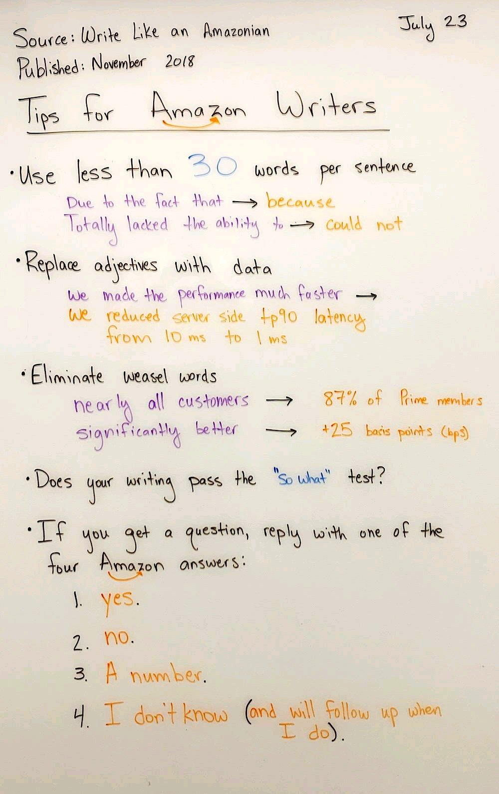

<!-- START doctoc generated TOC please keep comment here to allow auto update -->
<!-- DON'T EDIT THIS SECTION, INSTEAD RE-RUN doctoc TO UPDATE -->
## Table of Contents

- [Professional Programming - about this list](#professional-programming---about-this-list)
  - [Principles](#principles)
  - [Contributing to this list](#contributing-to-this-list)
  - [Must-read books](#must-read-books)
  - [Must-read articles](#must-read-articles)
  - [Other general material and list of resources](#other-general-material-and-list-of-resources)
    - [Other lists](#other-lists)
    - [Books](#books)
    - [Articles](#articles)
    - [Axioms](#axioms)
    - [Courses](#courses)
  - [Topics](#topics)
    - [Algorithm and data structures](#algorithm-and-data-structures)
    - [API design & development](#api-design--development)
    - [Attitude, habits, mindset](#attitude-habits-mindset)
      - [Procrastination](#procrastination)
    - [Authentication/authorization](#authenticationauthorization)
    - [Automation](#automation)
    - [Beyond software engineering & random](#beyond-software-engineering--random)
    - [Biases](#biases)
    - [Business](#business)
    - [Cache](#cache)
    - [Career growth](#career-growth)
      - [Choosing your next/first opportunity](#choosing-your-nextfirst-opportunity)
      - [Getting to Staff Eng](#getting-to-staff-eng)
    - [Characters sets](#characters-sets)
    - [Clouds](#clouds)
    - [Code reviews](#code-reviews)
    - [Coding & code quality](#coding--code-quality)
    - [Communication](#communication)
    - [Compilers](#compilers)
    - [Configuration](#configuration)
    - [Continuous Integration (CI)](#continuous-integration-ci)
    - [Databases](#databases)
      - [NoSQL](#nosql)
      - [Postgres](#postgres)
    - [Data formats](#data-formats)
    - [Data science/data engineering](#data-sciencedata-engineering)
    - [Debugging](#debugging)
    - [Design (visual, UX, UI, typography)](#design-visual-ux-ui-typography)
    - [Design (OO modeling, architecture, patterns, anti-patterns, etc.)](#design-oo-modeling-architecture-patterns-anti-patterns-etc)
      - [Design: database schema](#design-database-schema)
      - [Design: patterns](#design-patterns)
      - [Design: simplicity](#design-simplicity)
    - [Dev environment & tools](#dev-environment--tools)
    - [Diversity & inclusion](#diversity--inclusion)
    - [Docker](#docker)
    - [Documentation](#documentation)
    - [Dotfiles](#dotfiles)
    - [Editors & IDE](#editors--ide)
    - [Email](#email)
    - [Engineering management](#engineering-management)
    - [Exercises](#exercises)
    - [Experimentation](#experimentation)
    - [Functional programming (FP)](#functional-programming-fp)
    - [Games development](#games-development)
    - [Graphics](#graphics)
    - [Hardware](#hardware)
    - [HTTP](#http)
    - [Humor](#humor)
    - [Incident response (oncall, alerting, outages, firefighting, postmortem)](#incident-response-oncall-alerting-outages-firefighting-postmortem)
      - [Postmortem](#postmortem)
    - [Internet](#internet)
    - [Interviewing](#interviewing)
    - [Kubernetes](#kubernetes)
    - [Learning & memorizing](#learning--memorizing)
    - [Licenses (legal)](#licenses-legal)
    - [Linux (system management)](#linux-system-management)
    - [Low-code/no-code](#low-codeno-code)
    - [Low-level, assembly](#low-level-assembly)
    - [Machine learning/AI](#machine-learningai)
    - [Math](#math)
    - [Marketing](#marketing)
    - [Network](#network)
    - [Observability (monitoring, logging, exception handling)](#observability-monitoring-logging-exception-handling)
      - [Logging](#logging)
      - [Error/exception handling](#errorexception-handling)
      - [Monitoring](#monitoring)
    - [Open source](#open-source)
    - [Operating system (OS)](#operating-system-os)
    - [Over-engineering](#over-engineering)
    - [Performance](#performance)
    - [Personal knowledge management (PKM)](#personal-knowledge-management-pkm)
    - [Personal productivity](#personal-productivity)
    - [Perspective](#perspective)
    - [Privacy](#privacy)
    - [Problem solving](#problem-solving)
    - [Product management for software engineers](#product-management-for-software-engineers)
    - [Project management](#project-management)
    - [Programming languages](#programming-languages)
      - [Python](#python)
      - [JavaScript](#javascript)
      - [Garbage collection](#garbage-collection)
    - [Programming paradigm](#programming-paradigm)
    - [Public speaking (presenting)](#public-speaking-presenting)
    - [Reading](#reading)
    - [Refactoring](#refactoring)
    - [Regex](#regex)
    - [Releasing & deploying](#releasing--deploying)
      - [Versioning](#versioning)
      - [Checklists](#checklists)
      - [Feature flags](#feature-flags)
      - [Testing in production](#testing-in-production)
    - [Search](#search)
    - [Security](#security)
    - [Shell (command line)](#shell-command-line)
    - [SQL](#sql)
    - [System administration](#system-administration)
    - [System architecture](#system-architecture)
      - [Scalability](#scalability)
      - [Reliability](#reliability)
      - [Resiliency](#resiliency)
    - [Site Reliability Engineering (SRE)](#site-reliability-engineering-sre)
    - [Technical debt](#technical-debt)
    - [Testing](#testing)
    - [Tools](#tools)
    - [Type system](#type-system)
    - [Version control (Git)](#version-control-git)
    - [Work ethics, productivity & work/life balance](#work-ethics-productivity--worklife-balance)
    - [Web development](#web-development)
    - [Writing (communication, blogging)](#writing-communication-blogging)
  - [Resources & inspiration for presentations](#resources--inspiration-for-presentations)
  - [Keeping up-to-date](#keeping-up-to-date)
  - [Concepts](#concepts)
  - [My other lists](#my-other-lists)

<!-- END doctoc generated TOC please keep comment here to allow auto update -->

# Professional Programming - about this list

> Give me six hours to chop down a tree and I will spend the first four sharpening the axe. (Abraham Lincoln)

A collection of full-stack resources for programmers.

The goal of this page is to make you a more proficient developer. You'll find only resources that I've found truly inspiring, or that have become timeless classics.

## Principles

- This page is not meant to be comprehensive. I am trying to keep it light and not too overwhelming.
- The selection of articles is opinionated.
- I don't necessarily agree with or endorse every single line that is written in every single one of those resources. The same applies to their authors: I don't endorse everything each of those authors has said and will ever say.

Items:

- 🧰 : list of resources
- 📖 : book
- 🎞 : video/movie extract/movie/talk
- 🏙 : slides/presentation
- ⭐️ : must-read
- 📃 : paper

## Contributing to this list

Feel free to open a PR to contribute!

I will not be adding everything: as stated above, I am trying to keep the list concise.

## Must-read books

I've found these books incredibly inspiring:

- 📖 [The Pragmatic Programmer: From Journeyman to Master](https://pragprog.com/titles/tpp20/): hands-on the most inspiring and useful book I've read about programming.
- 📖 [Code Complete: A Practical Handbook of Software Construction](http://www.amazon.com/Code-Complete-Practical-Handbook-Construction/dp/0735619670): a nice addition to The Pragmatic Programmer, gives you the necessary framework to talk about code.
- 📖 [Release It!](https://smile.amazon.com/Release-Design-Deploy-Production-Ready-Software/dp/1680502395): this books goes beyond code and gives you best practices for building production-ready software. It will give you about 3 years worth of real-world experience.
- 📖 [Scalability Rules: 50 Principles for Scaling Web Sites](https://smile.amazon.com/Scalability-Rules-Principles-Scaling-Sites/dp/013443160X)
- 📖 [The Linux Programming Interface: A Linux and UNIX System Programming Handbook](http://www.amazon.com/The-Linux-Programming-Interface-Handbook/dp/1593272200): outside of teaching you almost everything you need to know about Linux, this book will give you insights into how software evolves, and the value of having simple & elegant interfaces.
- 📖 [Structure and interpretation of Computer Programs](https://web.mit.edu/6.001/6.037/sicp.pdf) (free): One of the most influential textbooks in Computer Science (written and used at MIT), SICP has been influential in CS education. [Byte](<https://en.wikipedia.org/wiki/Byte_(magazine)>) recommended SICP "for professional programmers who are really interested in their profession".

There are some free books available, including:

- 📖 [Professional software development](http://mixmastamyk.bitbucket.io/pro_soft_dev/): pretty complete and a good companion to this page. The free chapters are mostly focused on software development processes: design, testing, code writing, etc. - and not so much about tech itself.
- 🧰 [vhf/free-programming-books](https://github.com/vhf/free-programming-books)
- 🧰 [EbookFoundation/free-programming-books](https://github.com/EbookFoundation/free-programming-books/blob/master/books/free-programming-books.md)

## Must-read articles

- [Practical Advice for New Software Engineers](http://product.hubspot.com/blog/practical-advice-for-new-software-engineers)
- [On Being A Senior Engineer](http://www.kitchensoap.com/2012/10/25/on-being-a-senior-engineer/)
- [Lessons Learned in Software Development](http://henrikwarne.com/2015/04/16/lessons-learned-in-software-development/): one of those articles that give you years of hard-earned lessons, all in one short article. Must read.
- [Things I Learnt The Hard Way](https://blog.juliobiason.me/thoughts/things-i-learnt-the-hard-way/)
  - Spec first, then code
  - Tests make better APIs
  - Future thinking is future trashing
  - Documentation is a love letter to your future self
  - Sometimes, it's better to let the application crash than do nothing
  - Understand and stay away of cargo cult
  - "Right tool for the job" is just to push an agenda
  - Learn the basics functional programming
  - ALWAYS use timezones with your dates
  - ALWAYS use UTF-8
  - Create libraries
  - Learn to monitor
  - Explicit is better than implicit
  - Companies look for specialists but keep generalists longer
  - The best secure way to deal with user data is not to capture it
  - When it's time to stop, it's time to stop
  - You're responsible for the use of your code
  - Don't tell "It's done" when it's not
  - Pay attention on how people react to you
  - Beware of micro-aggressions
  - Keep a list of "Things I Don't Know"
- [Signs that you're a good programmer](https://skatgame.net/mburo//courses/350/signs-that-you-re-a-good-programmer.html) (not everything is here is great - some of the points are counterproductive)
  - The instinct to experiment first
  - Emotional detachment from code and design
  - Eager to fix what isn't broken
  - Fascinated by the incomprehensible
  - Compelled to teach
  - Incorruptible patience
  - A destructive pursuit of perfection
  - Encyclopedic grasp of the platform
  - Thinks In Code
  - When In Rome, Does As Romans Do
  - Creates their own tools
  - Indifferent to Hierarchy
  - Excited by failure
  - Indifferent to circumstances
  - Substitutes impulse for commitment
  - Driven by experiences
- [7 absolute truths I unlearned as junior developer](https://monicalent.com/blog/2019/06/03/absolute-truths-unlearned-as-junior-developer/)
  - Early in your career, you can learn 10x more in a supportive team in 1 year, than coding on your own
  - Every company has problems, every company has technical debt.
  - Being overly opinionated on topics you lack real-world experience with is pretty arrogant.
  - Many conference talks cover proof of concepts rather than real-world scenarios.
  - Dealing with legacy is completely normal.
  - Architecture is more important than nitpicking.
  - Focus on automation over documentation where appropriate.
  - Having some technical debt is healthy.
  - Senior engineers must develop many skills besides programming.
  - We’re all still junior in some areas.
- [How to Build Good Software](https://www.csc.gov.sg/articles/how-to-build-good-software)
  - A good high-level summary of fundamental engineering practices.
  - The root cause of bad software has less to do with specific engineering choices, and more to do with how development projects are managed.
  - There is no such thing as platonically good engineering: it depends on your needs and the practical problems you encounter.
  - Software should be treated not as a static product, but as a living manifestation of the development team’s collective understanding.
  - Software projects rarely fail because they are too small; they fail because they get too big.
  - Beware of bureaucratic goals masquerading as problem statements. If our end goal is to make citizens’ lives better, we need to explicitly acknowledge the things that are making their lives worse.
  - Building software is not about avoiding failure; it is about strategically failing as fast as possible to get the information you need to build something good.
- [How to be a -10x Engineer](https://taylor.town/-10x)
    - Nullify the output of 10 engineers.
    - Hold 10 engineers hostage in a technical discussion.
    - Waste 10 weeks of wages on cloud costs.
    - Waste 400 hours of engineering on bad architecture.
    - Incur 400 hours of bug triage.

## Other general material and list of resources

### Other lists

- [liuchong/awesome-roadmaps: A curated list of roadmaps.](https://github.com/liuchong/awesome-roadmaps)

### Books

- [The Imposter's Handbook](https://bigmachine.io/products/the-imposters-handbook) - \$30. From the author: "Don't have a CS Degree? Neither do I - That's why I wrote this book."
- [The Computer Science Book](https://thecomputersciencebook.com/book/)

### Articles

- [mr-mig/every-programmer-should-know: a collection of (mostly) technical things every software developer should know](https://github.com/mr-mig/every-programmer-should-know)
- [Famous Laws Of Software Development](https://www.timsommer.be/famous-laws-of-software-development/)
- [The Amazon Builders' Library](https://aws.amazon.com/builders-library/?cards-body.sort-by=item.additionalFields.customSort&cards-body.sort-order=asc)
  - There is a list of the best articles in this [Twitter Thread](https://twitter.com/g_bonfiglio/status/1673650452846505985)
- [kdeldycke/awesome-falsehood](https://github.com/kdeldycke/awesome-falsehood): Falsehoods Programmers Believe in
- [hellerve/programming-talks](https://github.com/hellerve/programming-talks)
- [TechYaks](https://techyaks.com/): list of talks
- [Talks that changed the way I think about programming](http://www.opowell.com/post/talks-that-changed-the-way-i-think-about-programming/)
- [What every computer science major should know](http://matt.might.net/articles/what-cs-majors-should-know/)
- [kamranahmedse/developer-roadmap](https://github.com/kamranahmedse/developer-roadmap)
- [mtdvio/every-programmer-should-know](https://github.com/mtdvio/every-programmer-should-know): a collection of (mostly) technical things every software developer should know about
- [Mike Acton’s Expectations of Professional Software Engineers](https://adamj.eu/tech/2022/06/17/mike-actons-expectations-of-professional-software-engineers/)
- [Things they didn't teach you about Software Engineering](https://vadimkravcenko.com/shorts/things-they-didnt-teach-you/)
  - Domain knowledge is more important than your coding skills
  - Code is secondary. Business value is first.
  - You work with uncertainty most of the time
- [We overestimate our short-term ability, but underestimate our long-term ability.](https://paavandesign.com/blog/ostaulta/)
  - Specialisation is for insects.
- [Want an unfair advantage in your tech career? Consume content meant for other roles](https://matthewgrohman.substack.com/p/want-an-unfair-advantage-in-your)
  - Cross-functional understanding is critical in modern tech companies
  - Helps to avoid underestimating the importance and difficulty other roles
  - Helps you to be strategic in your interaction with people in that role
- [Teach Yourself Programming in Ten Years](https://norvig.com/21-days.html)

### Axioms

- [Precepts - Urbit](https://urbit.org/blog/precepts/)
  - Data is better than code.
  - Correctness is more important than performance.
  - Deterministic beats heuristic.
  - One hundred lines of simplicity is better than twenty lines of complexity.
  - If your abstractions are leaking, it's not due to some law of the universe; you just suck at abstracting. Usually, you didn't specify the abstraction narrowly enough.
  - If you avoid changing a section of code for fear of awakening the demons therein, you are living in fear. If you stay in the comfortable confines of the small section of the code you wrote or know well, you will never write legendary code. All code was written by humans and can be mastered by humans.
  - If there's clearly a right way to do something and a wrong way, do it the right way. Coding requires incredible discipline.
  - The best way to get the right answer is to try it the wrong way.
  - Practice tells you that things are good or bad; theory tells you why.
  - Not being qualified to solve a problem is no reason not to solve it.
  - If you don't understand a system you're using, you don't control it. If nobody understands the system, the system is in control.
- [Embedded Rules of Thumb](https://embeddedartistry.com/blog/2018/04/26/embedded-rules-of-thumb/)
- [50 Ideas That Changed My Life](https://www.perell.com/blog/50-ideas-that-changed-my-life)
- [Reflections on 10,000 Hours of Programming](https://matt-rickard.com/reflections-on-10-000-hours-of-programming/)
- [20 Things I've Learned in my 20 Years as a Software Engineer](https://www.simplethread.com/20-things-ive-learned-in-my-20-years-as-a-software-engineer/)

### Courses

- [Google Tech Dev Guide](https://techdevguide.withgoogle.com/)
- [The Missing Semester of Your CS Education](https://missing.csail.mit.edu/), MIT. Includes lectures about the shell, editors, data wrangling, git, debugging and profiling, meta programming, security and cryptography.
- [Mathematics for the adventurous self-learner](https://www.neilwithdata.com/mathematics-self-learner), Neil Sainsbury
- [jwasham/coding-interview-university](https://github.com/jwasham/coding-interview-university): a complete computer science study plan to become a software engineer.
- [Teach Yourself Computer Science](https://teachyourselfcs.com/): an opinionated set of the best CS resources.
- [ossu/computer-science](https://github.com/ossu/computer-science): free self-taught education in Computer Science!

## Topics

### Algorithm and data structures

- Read the [CLRS](https://mitpress.mit.edu/books/introduction-algorithms). You can watch and download the course on [OCW](http://ocw.mit.edu/courses/electrical-engineering-and-computer-science/6-046j-introduction-to-algorithms-sma-5503-fall-2005/) - there are newer courses as well.
- Or [The Algorithm Design Manual](https://www.amazon.com/Algorithm-Design-Manual-Steven-Skiena/dp/1849967202?ie=UTF8&qid=1297127794&ref_=sr_1_1&sr=8-1)
- Try out some algorithms on [Project Euler](https://projecteuler.net/)
- [CS 61B Spring 2023](https://sp23.datastructur.es/)

Other resources:

- [Algorithms](http://jeffe.cs.illinois.edu/teaching/algorithms/), Jeff Erickson

Let's be honest: algorithms can be a pretty dry topic. [This quora question](https://www.quora.com/Is-there-a-book-that-teaches-algorithms-data-structures-and-other-computer-science-basics-in-a-fun-way) lists some funnier learning alternative, including:

- [Grokking Algorithms](https://www.amazon.com/dp/1617292230/ref=cm_sw_su_dp)
- [Essential Algorithms](https://www.amazon.com/Essential-Algorithms-Practical-Approach-Computer/dp/1118612108?ie=UTF8&*Version*=1&*entries*=0)
- [Data Structure Visualization](https://www.cs.usfca.edu/~galles/visualization/Algorithms.html)
- 🎞 [15 Sorting Algorithms in 6 Minutes](https://www.youtube.com/watch?v=kPRA0W1kECg&ab_channel=TimoBingmann)
- [Hashing](https://samwho.dev/hashing/)
- [Visualizing Algorithms](https://bost.ocks.org/mike/algorithms/)

Example implementations:

- [trekhleb/javascript-algorithms](https://github.com/trekhleb/javascript-algorithms): algorithms and data structures implemented in JavaScript
- [The Algorithms](https://the-algorithms.com/)

Algorithms in distributed systems:

- [Raft Consensus Algorithm](https://raft.github.io/)

### API design & development

General REST content:

- [Architectural Styles and the Design of Network-based Software Architectures](https://www.ics.uci.edu/~fielding/pubs/dissertation/top.htm), Roy Fielding (the inventor of REST)
- [A collection of useful resources for building RESTful HTTP+JSON APIs.](https://github.com/yosriady/api-development-tools)
- [Best practices for REST API design](https://stackoverflow.blog/2020/03/02/best-practices-for-rest-api-design/), Stack Overflow Blog
- 📖 [Undisturbed REST: a guide to designing the perfect API](https://www.mulesoft.com/sites/default/files/resource-assets/ebook-UndisturbedREST_v1.pdf): very complete book about RESTful API design.

Example guidelines:

- [Microsoft's Rest API guidelines](https://github.com/Microsoft/api-guidelines/blob/master/Guidelines.md)
- [Zalando RESTful API and Event Scheme Guidelines](https://opensource.zalando.com/restful-api-guidelines/)
- [Google's API Design Guide](https://cloud.google.com/apis/design/): a general guide to design networked API.
- [AIP-1: AIP Purpose and Guidelines](https://google.aip.dev/1)
  - AIP stands for API Improvement Proposal, which is a design document providing high-level, concise documentation for API development.

More specific topics:

- [Why you should use links, not keys, to represent relationships in APIs](https://cloud.google.com/blog/products/application-development/api-design-why-you-should-use-links-not-keys-to-represent-relationships-in-apis), Martin Nally, Google
    - "Using links instead of foreign keys to express relationships in APIs reduces the amount of information a client needs to know to use an API, and reduces the ways in which clients and servers are coupled to each other."
- [Give me /events, not webhooks](https://blog.sequin.io/events-not-webhooks/)
  - Events can unlock much-needed webhook features, like allowing your webhook consumers to replay or reset the position of their webhook subscription.

### Attitude, habits, mindset

- [Mastering Programming](https://www.prod.facebook.com/notes/kent-beck/mastering-programming/1184427814923414#), Kent Beck.
- [The traits of a proficient programmer](https://www.oreilly.com/ideas/the-traits-of-a-proficient-programmer)
- [The tao of programming](http://www.mit.edu/~xela/tao.html): a set of parables about programming.
- [Taking Ownership Is The Most Effective Way to Get What You Want](http://www.theeffectiveengineer.com/blog/take-ownership-of-your-goals)
- [Finding Time to Become a Better Developer](https://medium.freecodecamp.org/finding-time-to-become-a-better-developer-eebc154881b2)
- [Ten minutes a day](https://blog.usejournal.com/ten-minutes-a-day-e2fa1084f924): how Alex Allain wrote a book in less than 200 hours, by writing 10 minutes _every_ day.
- [The care and feeding of software engineers (or, why engineers are grumpy)](https://humanwhocodes.com/blog/2012/06/12/the-care-and-feeding-of-software-engineers-or-why-engineers-are-grumpy/)
  - In the triumvirate of software, product managers, designers, and software engineers, only the engineers are expected to turn off their creative minds and just produce.
  - Both engineers and product managers tend to think, incorrectly, that product specifications or requirements are equivalent to the furniture manual from Ikea.
  - This is one of the top things that make engineers grumpy: constantly shifting priorities.
  - Even though many engineers will complain that product managers change their minds, almost none will account for that in their time estimates.
  - Computer science programs aren’t about preparing you for the tasks you’ll face in industry.
  - When there are more engineers than can be used, engineering time ends up going away from developing and towards planning, synchronization, and coordination.
  - Involve engineers in the creative process
  - Give engineers opportunities to be creative.
  - Encourage time off.
  - Let 'em code
  - Express appreciation
- [The Product-Minded Software Engineer](https://blog.pragmaticengineer.com/the-product-minded-engineer/), Gergely Orosz
  - Great product engineers know that minimum lovable products need the right depth
  - Product-minded engineers quickly map out edge cases and think of ways to reduce work on them: often bringing solutions that require no engineering work
  - Engage in user research and customer support
  - Bring well-backed product suggestions to the table
  - Offer product/engineering tradeoffs
- [40 Lessons From 40 Years](https://medium.com/@schlaf/40-lessons-from-40-years-de39d2c622d6), Steve Schlafman
  - If you want to make progress on the things that matter most, you need to decide who you’re going to disappoint. It’s inevitable.
  - The best investment you can make is your own education. Never stop learning. The second best investment you can make is building your network through authentic and meaningful interactions. It is what you know and who you know.
  - You’ll never get what you don’t ask for or actively seek out. Go for it!
  - It’s not about the light at the end of the tunnel. It’s the tunnel. Show up every day and enjoy the process.
  - A great teammate always puts the organization and its purpose ahead of their own self interests.
  - Pick your spots. We have limited time and our brains can only process so much. Focus is key. Choose wisely.
  - Every person is likely struggling with something. Be kind. Be helpful.
- [On Coding, Ego and Attention](https://josebrowne.com/on-coding-ego-and-attention/)
  - Beginner’s mind accepts the fact that absolute knowledge is infinite and thus keeping score is a waste of time.
  - Mastery is simply the accumulation of momentum, not the accumulation of knowledge.
  - Dealing with ego distraction has taught me to love the problem solving process. It’s taught me to love and respect the learning process. As a result I’m more productive. I’m less anxious. I’m a better teammate. I’m a better friend and a better thinker.
- [Fixed vs. Growth: The Two Basic Mindsets That Shape Our Lives](https://www.brainpickings.org/2014/01/29/carol-dweck-mindset/)
- [What does a great software engineer look like?](https://fwouts.com/articles/great-software-engineer)
- [Good sleep, good learning, good life](https://supermemo.guru/wiki/Good_sleep,_good_learning,_good_life)
- 🎞 [Steve Jobs: if you don't ask for help, you won't get very far](https://www.youtube.com/watch?v=zkTf0LmDqKI&ab_channel=SiliconValleyHistoricalAssociation)
- [Programming quotes](https://www.ronaldsvilcins.com/2020/12/10/programming-quotes/)
- [Be Kind](https://boz.com/articles/be-kind)
  - Being kind is fundamentally about taking responsibility for your impact on the people around you.
  - It requires you be mindful of their feelings and considerate of the way your presence affects them.
- [Warren Buffett Says This 1 Simple Habit Separates Successful People From Everyone Else](https://www.inc.com/marcel-schwantes/warren-buffett-says-this-is-1-simple-habit-that-separates-successful-people-from-everyone-else.html)
  - The difference between successful people and really successful people is that really successful people say no to almost everything.
- [How to get lucky?](https://jjude.com/luck)
- [Programmers should stop celebrating incompetence](https://world.hey.com/dhh/programmers-should-stop-celebrating-incompetence-de1a4725), DHH
  - The magic of programming is largely just things you don't know yet.
  - It's not fine to think you shouldn't be on some paths towards mastery, if you intend to make programming your career.
- [There’s no speed limit](https://sive.rs/kimo)
- [Don't Wait for Motivation, Act for Momentum](https://salman.io/blog/momentum-motivation/)
  - Start with a tiny task. Then ride its momentum.
- [The Most Important Coding Habits](https://puppycoding.com/2023/07/22/healthy-coding-habits/)
  - The Most Important Coding Habits
  - Daily stretches
  - Take regular breaks
  - Don’t code late at night
  - Improve your coding environment

> Imposter syndrome is underrated: a lot of talk goes into overcoming imposter syndrome. I say embrace self-skepticism and doubt yourself every day. In a fast-moving industry where lots of your knowledge expires every year, even the most junior people around you constantly cook up skills you don't have; you stay competitive by applying with the determination (and even fear) of the novice. The upside of this treadmill is that every engineer is on it: just because you're an imposter doesn't mean that other people are more deserving than you, because they're imposters too. You should advocate for yourself, take risks, pat yourself on the back when things go well, and, as you start to build a track record of solving problems, trust your skills and adaptability. Just make no mistake: you're only as good as the last problem you solve.

Dan Heller, Building a Career in Software

> I had learned already never to empty the well of my writing, but always to stop when there was still something there in the deep part of the well, and let it refill at night from the springs that fed it. -- Ernest Hemingway
- [The Grug Brained Developer](https://grugbrain.dev): habits of self-aware programmer. Like Tao of Programming, different style.

> Good judgment comes from experience.
> Experience comes from bad judgment.

#### Procrastination

- [News is bad for you – and giving up reading it will make you happier](https://www.theguardian.com/media/2013/apr/12/news-is-bad-rolf-dobelli), The Guardian
  - News misleads
  - News is irrelevant
  - News has no explanatory power
  - News is toxic to your body
  - News increases cognitive errors
  - News inhibits thinking
  - News works like a drug
  - News wastes time
  - News makes us passive
  - News kills creativity

### Authentication/authorization

- [Authorization in a microservices world](https://www.alexanderlolis.com/authorization-in-a-microservices-world)
- [Authorization Logic: Rules are hard because they evolve over time](https://www.osohq.com/post/rules-are-hard-logic-for-authorization)

### Automation

- [Automation Should Be Like Iron Man, Not Ultron](http://queue.acm.org/detail.cfm?id=2841313)

### Beyond software engineering & random

- [Why Software Engineers like Woodworking](https://www.zainrizvi.io/blog/why-software-engineers-like-woodworking/)

### Biases

Biases don't only apply to hiring. For instance, the fundamental attribution bias also applies when criticizing somebody's code written a long time ago, in a totally different context.

- [Cognitive bias cheat sheet](https://betterhumans.coach.me/cognitive-bias-cheat-sheet-55a472476b18#.6temb6hyg). #hiring

### Business

- [Payments 101 for a Developer](https://github.com/juspay/hyperswitch/wiki/Payments-101-for-a-Developer)
- [The 4 biggest problems with homemade billing systems](https://www.getlago.com/blog/the-4-biggest-problems-with-homemade-billing-systems)

### Cache

- [Caching challenges and strategies](https://aws.amazon.com/builders-library/caching-challenges-and-strategies/), Amazon Builders Library

### Career growth

- [The Conjoined Triangles of Senior-Level Development](http://frontside.io/blog/2016/07/07/the-conjoined-triangles-of-senior-level-development.html) looks into how to define a senior engineer.
- [Ten Principles for Growth as an Engineer](https://medium.com/@daniel.heller/ten-principles-for-growth-69015e08c35b), Dan Heller.
- [Don't Call Yourself a Programmer](https://www.kalzumeus.com/2011/10/28/dont-call-yourself-a-programmer/), Patrick McKenzie.
- [On being an Engineering Manager](https://nickmchardy.com/2019/02/on-being-an-engineering-manager.html)
- [The career advice I wish I had at 25](https://www.linkedin.com/pulse/career-advice-i-wish-had-25-shane-rodgers/?trk=hp-feed-article-title-like)
  - A career is a marathon, not a sprint
  - Most success comes from repetition, not new things
  - If work was really so great all the rich people would have the jobs
  - Management is about people, not things
  - Genuinely listen to others
  - Recognise that staff are people with finite emotional capacity
  - Don’t just network with people your own age
  - Never sacrifice personal ethics for a work reason
  - Recognise that failure is learning
- [Career advice I wish I’d been given when I was young](https://80000hours.org/2019/04/career-advice-i-wish-id-been-given-when-i-was-young/)
  - Don’t focus too much on long-term plans.
  - Find good thinkers and cold-call the ones you most admire.
  - Assign a high value to productivity over your whole lifespan.
  - Don’t over-optimise things that aren’t your top priority.
  - Read a lot, and read things that people around you aren’t reading.
  - Reflect seriously on what problem to prioritise solving.
  - Read more history.
- [Why Good Developers are Promoted into Unhappiness](https://robwalling.com/2007/06/27/why-good-developers-are-promoted-into-unhappiness/), Rob Walling. Or why management might not be for you.
- [A guide to using your career to help solve the world’s most pressing problems](https://80000hours.org/key-ideas/)
- [What's a senior engineer's job?](https://jvns.ca/blog/senior-engineer/) You need to be more than just an individual contributor.
- [From Coding Bootcamp Graduate to Building Distributed Databases](https://medium.com/swlh/from-coding-bootcamp-graduate-to-building-distributed-databases-29acbb723d8)
  - Read Books (and papers), not Blog Posts
  - Take responsibility for your career trajectory
- 🏙 [The Well Rounded Engineer](https://speakerdeck.com/swanandp/the-well-rounded-engineer) includes lots of great book recommendations.
  - Paradigm polyglot (learn different languages & paradigms)
  - Database polyglot
  - Protocol polyglot (preferably TCP/IP and HTTP)
  - Proficiency with build tooling, packaging and distribution
  - Debugging, observability
  - Deployment, infra and devops
  - Software architecture and scaling
  - Ability to write toy compilers, interpreters and parsers
  - Ability to write toy games
  - Ability to understand algorithmic analysis
- [Some career advice](https://lethain.com/career-advice/), Will Larson.
  - Advice you get is someone’s attempt to synthesize their experiences, not an accurate statement about how the world works.
  - Build a reservoir of prestige.
  - Some folks are so good at something that they end up being irreplaceable in their current role, which causes them to get stuck in their role even if they’re a good candidate for more interesting ones.
  - Great relationships will follow you everywhere you go. Bad ones too.
  - Early in your career, try to work at as many different kinds of companies and in different product vertical as you can.
- [Evil tip: avoid "easy" things](http://yosefk.com/blog/evil-tip-avoid-easy-things.html)
- [The Ultimate Code Kata](https://blog.codinghorror.com/the-ultimate-code-kata/)
- [Traits of a senior software engineer](https://sergiomartins8.hashnode.dev/why-is-a-senior-engineer-senior): impact, perception, visibility, influence, mentoring
- [Software Engineering - The Soft Parts](https://addyosmani.com/blog/software-engineering-soft-parts/)
  - Think critically and formulate well-reasoned arguments
  - Master the fundamentals
  - Focus on the user and all else will follow
  - Learn how to learn
- [How To Own Your Growth As A Software Engineer](https://jes.al/2022/07/how-to-own-your-growth-as-a-software-engineer/)
- [The Forty-Year Programmer](https://codefol.io/posts/the-forty-year-programmer/)
  - The Better You Get, the Less You Look Like Everybody Else
  - You Learn Deep Principles by Doing the Basics
  - Look to Other Fields, Learn From Other Fields
  - Be Careful About Productivity Tips
- [Senior Engineers are Living in the Future](https://www.zerobanana.com/essays/living-in-the-future/)
- [What would a map of your career look like?](https://tomcritchlow.com/2023/04/26/career-maps/)

#### Choosing your next/first opportunity

- [Career Decisions - by Elad Gil - Elad Blog](https://blog.eladgil.com/p/career-decisions)

#### Getting to Staff Eng

- [I became a FAANG Staff Engineer in 5 years. These are the 14 lessons I learned along the way.](https://medium.com/geekculture/i-became-a-faang-staff-engineer-in-5-years-here-are-the-14-lessons-i-learned-along-the-way-f70ac078875c)
  - Software engineering isn’t just coding. Actually, coding is a small part of it.
  - Pipeline your work
  - Be open to feedback and listen. Like, seriously, listen.
  - Great feedback is hard to find; treasure it.
  - Keep an eye on the horizon (but not both).
  - Figure out what matters and let the rest go.
  - Comparison really is the thief of joy.
  - Mentorship is a beautiful thing.
  - Good days, in general, don’t just “happen”.
  - Advice and guidance are just that; they aren’t rules.
- [Guides for reaching Staff-plus engineering roles](https://staffeng.com/guides/), Will Larson
  - [Being visible](https://staffeng.com/guides/being-visible)
  - [Additional resources on Staff-plus engineering](https://staffeng.com/guides/learning-materials)

### Characters sets

- [The Absolute Minimum Every Software Developer Absolutely, Positively Must Know About Unicode and Character Sets (No Excuses!)](http://www.joelonsoftware.com/articles/Unicode.html)
- [The Absolute Minimum Every Software Developer Must Know About Unicode in 2023 (Still No Excuses!)](https://tonsky.me/blog/unicode/)

### Clouds

- [open-guides/og-aws](https://github.com/open-guides/og-aws): a practical guide to AWS

### Code reviews

- [How to do a code review](https://google.github.io/eng-practices/review/reviewer/), Google's engineering practices documentation.
- [Post-Commit Reviews](https://medium.com/@copyconstruct/post-commit-reviews-b4cc2163ac7a): an interesting idea to increase developer velocity (there are some caveats though).
- [How to Make Your Code Reviewer Fall in Love with You](https://mtlynch.io/code-review-love/)
    - Review your own code first
    - Write a clear changelist description
    - Automate the easy stuff
    - Answer questions with the code itself
    - Narrowly scope changes
    - Separate functional and non-functional changes
    - Respond graciously to critiques
    - Artfully solicit missing information
    - Award all ties to your reviewer
    - Minimize lag between rounds of review
- [How to Do Code Reviews Like a Human](https://mtlynch.io/human-code-reviews-1/)
- [Ask HN: How do you review code?](https://news.ycombinator.com/item?id=11416746): great discussion on HackerNews, full of interesting ideas.
- [Maslow's pyramid of code reviews](https://www.dein.fr/posts/2015-02-18-maslows-pyramid-of-code-review)
  - Another one on the same topic: [The Code Review Pyramid](https://www.morling.dev/blog/the-code-review-pyramid/)
- [Code review in remote teams](https://web.hypothes.is/blog/code-review-in-remote-teams/): very complete set of rules.
- [No code reviews by default](https://www.raycast.com/blog/no-code-reviews-by-default/)
  - Responsibility over convention

### Coding & code quality

- [Write code that is easy to delete, not easy to extend](http://programmingisterrible.com/post/139222674273/write-code-that-is-easy-to-delete-not-easy-to)
- [The Ten Commandments of Egoless Programming](http://blog.codinghorror.com/the-ten-commandments-of-egoless-programming/)
- 📖 [Clean Code: A Handbook of Agile Software Craftsmanship](https://www.goodreads.com/book/show/3735293-clean-code), Robert C. Martin. Describes numerous useful best practices. A bit long. There's also a [clean code cheatsheet](cheatsheets/Clean-Code-V2.4.pdf).
- [What Software Craftsmanship is about](https://blog.cleancoder.com/uncle-bob/2011/01/17/software-craftsmanship-is-about.html)
  - We’re tired of writing crap.
  - We will not accept the stupid old lie about cleaning things up later.
  - We will not believe the claim that quick means dirty.
  - We will not allow anyone to force us to behave unprofessionally.
- [Tips on naming boolean variables](https://dev.to/michi/tips-on-naming-boolean-variables-cleaner-code-35ig)
  - There is a convention to prefix boolean variables and function names with "is" or "has".
  - Try to always use is, even for plurals (`isEachUserLoggedIn` is better than `areUsersLoggedIn` or `isUsersLoggedIn`)
  - Avoid custom prefixes (`isPaidFor` is better than `wasPaidFor`)
  - Avoid negatives (`isEnabled` is better than `isDisabled`)
- [How To Write Unmaintainable Code](https://github.com/Droogans/unmaintainable-code/blob/master/README.md)
- [kettanaito/naming-cheatsheet](https://github.com/kettanaito/naming-cheatsheet): : comprehensive language-agnostic guidelines on variables naming. Home of the A/HC/LC pattern.
- 🧰 [Quality Engineering Guides](https://qeunit.com/guides/)

### Communication

See also the Writing section

- [How to communicate effectively as a developer](https://www.karlsutt.com/articles/communicating-effectively-as-a-developer/)
  - Lots of concrete advice and examples for short, medium and long-form writing

### Compilers

- [The Compiler Writer Resource Page](https://c9x.me/compile/bib/)
- [kanaka/mal](https://github.com/kanaka/mal): mal - Make a Lisp

### Configuration

- [The downsides of JSON for config files](https://arp242.net/weblog/JSON_as_configuration_files-_please_dont.html), Martin Tournoij.
  - Can't add comments
  - Excessive quotation and syntax noise
  - Using DC (declarative configuration) to control logic is often not a good idea.
- [Your configs suck? Try a real programming language](https://beepb00p.xyz/configs-suck.html)
  - Most modern config formats suck
  - Use a real programming language

### Continuous Integration (CI)

- [Continuous Integration](https://martinfowler.com/articles/continuousIntegration.html), MartinFowler.com

### Databases

See also the SQL section.

- [A plain English introduction to CAP Theorem](http://ksat.me/a-plain-english-introduction-to-cap-theorem)
- [PACELC theorem](https://en.wikipedia.org/wiki/PACELC_theorem): "in case of network partitioning (P) in a distributed computer system, one has to choose between availability (A) and consistency (C) (as per the CAP theorem), but else (E), even when the system is running normally in the absence of partitions, one has to choose between latency (L) and consistency (C)."
- [Zero downtime database migrations](https://blog.rainforestqa.com/2014-06-27-zero-downtime-database-migrations/) (code examples are using Rails but this works great for any programming language)
- [Algorithms Behind Modern Storage Systems](https://queue.acm.org/detail.cfm?id=3220266), ACM Queue
- [Let's Build a Simple Database](https://cstack.github.io/db_tutorial/)
- [Readings in Database Systems, 5th Edition](http://www.redbook.io/)
- [Comparing database types: how database types evolved to meet different needs](https://dataguide.prisma.io/intro/comparing-database-types)
- [How does a relational database work](http://coding-geek.com/how-databases-work/)
- [Use the index, Luke](https://use-the-index-luke.com/)
- [Course introduction — MySQL for Developers](https://planetscale.com/learn/courses/mysql-for-developers/introduction/course-introduction), PlanetScale
- [How Query Engines Work](https://howqueryengineswork.com/00-introduction.html)

#### NoSQL

- [NOSQL Patterns](http://horicky.blogspot.nl/2009/11/nosql-patterns.html)
- [NoSQL Databases: a Survey and Decision Guidance](https://medium.baqend.com/nosql-databases-a-survey-and-decision-guidance-ea7823a822d#.9fe79qr90)
- The DynamoDB docs has some great pages:
  - [Read Consistency](https://docs.aws.amazon.com/amazondynamodb/latest/developerguide/HowItWorks.ReadConsistency.html)
  - [From SQL to NoSQL](https://docs.aws.amazon.com/amazondynamodb/latest/developerguide/SQLtoNoSQL.html)
  - [NoSQL Design for DynamoDB](https://docs.aws.amazon.com/amazondynamodb/latest/developerguide/bp-general-nosql-design.html)
- [Redis Explained](https://architecturenotes.co/redis/)

#### Postgres

- [Safe Operations For High Volume PostgreSQL](https://www.braintreepayments.com/blog/safe-operations-for-high-volume-postgresql/) (this is for PostgreSQL but works great for other DBs as well).
- [Transaction Isolation in Postgres, explained](https://www.thenile.dev/blog/transaction-isolation-postgres)
- [PostgreSQL exercises](https://pgexercises.com/)
- [Operations cheat sheet](https://wiki.postgresql.org/wiki/Operations_cheat_sheet)
- [Postgres is Enough](https://gist.github.com/cpursley/c8fb81fe8a7e5df038158bdfe0f06dbb)
- [Don't Do This](https://wiki.postgresql.org/wiki/Don't_Do_This)

### Data formats

- [Falsehoods Programmers Believe About Phone Numbers](https://github.com/googlei18n/libphonenumber/blob/master/FALSEHOODS.md), Google's `libphonenumber`.
- [Rules for Autocomplete](http://jeremymikkola.com/posts/2019_03_19_rules_for_autocomplete.html): rough specifications for autocomplete fields
- [Falsehoods programmers believe about addresses](https://www.mjt.me.uk/posts/falsehoods-programmers-believe-about-addresses/)
- [Falsehoods Programmers Believe About Names](https://www.kalzumeus.com/2010/06/17/falsehoods-programmers-believe-about-names/)
- [kdeldycke/awesome-falsehood](https://github.com/kdeldycke/awesome-falsehood): falsehoods programmers believe in
- [Understanding UUIDs, ULIDs and String Representations](https://sudhir.io/uuids-ulids)
- [Falsehoods Programmers Believe About Falsehoods Lists](https://kevin.deldycke.com/2016/12/falsehoods-programmers-believe-about-falsehoods-lists/)

### Data science/data engineering

- [A dirty dozen: twelve common metric interpretation pitfalls in online controlled experiments](https://blog.acolyer.org/2017/09/25/a-dirty-dozen-twelve-common-metric-interpretation-pitfalls-in-online-controlled-experiments/)
- [datastacktv/data-engineer-roadmap](https://github.com/datastacktv/data-engineer-roadmap): roadmap to becoming a data engineer
- [Awesome Data Engineering Learning Path](https://awesomedataengineering.com/)
- [Emerging Architectures for Modern Data Infrastructure](https://a16z.com/2020/10/15/the-emerging-architectures-for-modern-data-infrastructure/)
- [How to Move Beyond a Monolithic Data Lake to a Distributed Data Mesh](https://martinfowler.com/articles/data-monolith-to-mesh.html)
  - Data platforms based on the data lake architecture have common failure modes that lead to unfulfilled promises at scale.
  - We need to consider domains as the first class concern, apply platform thinking to create self-serve data infrastructure, and treat data as a product.
- [MLOps](https://madewithml.com/courses/mlops/)
- [Uber's Big Data Platform: 100+ Petabytes with Minute Latency](https://eng.uber.com/uber-big-data-platform/)
- [SQL should be the default choice for data transformation logic](https://www.robinlinacre.com/recommend_sql/)

### Debugging

- [Rubber Duck Problem Solving](http://blog.codinghorror.com/rubber-duck-problem-solving/)
- [Rubber Ducking](http://c2.com/cgi/wiki?RubberDucking)
- [Five Whys](https://en.wikipedia.org/wiki/5_Whys)
- [The Infinite Hows](http://www.kitchensoap.com/2014/11/14/the-infinite-hows-or-the-dangers-of-the-five-whys/): this provides a strong criticism of the five whys method.
- [Linux Performance Analysis in 60,000 Milliseconds](http://techblog.netflix.com/2015/11/linux-performance-analysis-in-60s.html)
- [Post-Mortems at HubSpot: What I Learned From 250 Whys](https://product.hubspot.com/blog/bid/64771/post-mortems-at-hubspot-what-i-learned-from-250-whys)
- [Debugging zine](https://jvns.ca/debugging-zine.pdf), Julian Evans
- [If you understand a bug, you can fix it](https://wizardzines.com/comics/understand-can-fix/)
- [The Thirty Minute Rule](https://daniel.feldroy.com/posts/thirty-minute-rule): if anyone gets stuck on something for more than 30 minutes, they should ask for help
- [How to create a Minimal, Reproducible Example ](https://stackoverflow.com/help/minimal-reproducible-example), Stack Overflow
- [Some ways to get better at debugging](https://jvns.ca/blog/2022/08/30/a-way-to-categorize-debugging-skills/), Julia Evans
  - Learn the codebase
  - Learn the system (e.g., HTTP stack, database transactions)
  - Learn your tools (e.g., `strace`, `tcpdump`)
  - Learn strategies (e.g., writing code to reproduce, adding logging, taking a break)
  - Get experience: according to a study, "experts simply formed more correct hypotheses and were more efficient at finding the fault."
- [What exactly is the 'Saff Squeeze' method of finding a bug?](https://stackoverflow.com/questions/23865274/what-exactly-is-the-saff-squeeze-method-of-finding-a-bug)
  - A systematic technique for deleting both test code and non-test code from a failing test until the test and code are small enough to understand.
- [tcpdump is amazing](https://jvns.ca/blog/2016/03/16/tcpdump-is-amazing/), Julia Evans

### Design (visual, UX, UI, typography)

I highly recommend reading [The Non-Designer's Design Book](http://www.amazon.com/gp/product/0133966151/ref=pd_lpo_sbs_dp_ss_1?pf_rd_p=1944687602&pf_rd_s=lpo-top-stripe-1&pf_rd_t=201&pf_rd_i=0321534042&pf_rd_m=ATVPDKIKX0DER&pf_rd_r=1R7MVQP0BCP7GP9VZGYX). This is a pretty short book that will give you some very actionable design advices.

- If you're working on data, Edward Tufte's [The Visual Display of Quantitative Information](http://www.amazon.com/Visual-Display-Quantitative-Information/dp/0961392142/ref=sr_1_1?ie=UTF8&qid=1458046603&sr=8-1&keywords=tufte) is considered a classic.
- The [Universal Principles of Design](http://www.amazon.com/Universal-Principles-Design-Revised-Updated/dp/1592535879/ref=sr_1_1?ie=UTF8&qid=1458046663&sr=8-1&keywords=universal+principles+of+design) will give you enough vocabulary and concepts to describe design challenges into words.
- [Book recommendations from HackerNews](https://news.ycombinator.com/item?id=12711060)
- 🏙[Design for Non-Designers](https://speakerdeck.com/tracymakes/design-for-non-designers-beyond-tellerand-dusseldorf-2018)

Articles :

- [10 Usability Heuristics Every Designer Should Know](https://uxdesign.cc/10-usability-heuristics-every-designer-should-know-129b9779ac53)
  - Visibility of System Status
  - The Match Between The System And The Real World
  - Every system should have a clear emergency exit
  - Don't forget that people spend 90% of their time interacting with other apps
  - Recognition Rather Than Recall (recognition = shallow form of retrieval from memory, e.g. a familiar person, recall = deeper retrieval)
  - ”Perfection is achieved, not when there is nothing more to add, but when there is nothing left to take away.” – Antoine de Saint-Exupery
  - Help Users Recognize, Diagnose, And Recover From Errors
- [Butterick’s Practical Typography](https://practicaltypography.com/)
- [How to pick more beautiful colors for your data visualizations](https://blog.datawrapper.de/beautifulcolors/)
- [Typography for Lawyers](https://typographyforlawyers.com/)
- [Visual design rules you can safely follow every time](https://anthonyhobday.com/sideprojects/saferules/)

Resources:

- 🧰 [bradtraversy/design-resources-for-developers](https://github.com/bradtraversy/design-resources-for-developers): design and UI resources from stock photos, web templates, CSS frameworks, UI libraries, tools...

### Design (OO modeling, architecture, patterns, anti-patterns, etc.)

Here's a list of good books:

- 📖 [Design Patterns: Elements of Reusable Object-Oriented Software](http://www.amazon.com/dp/0201633612/): dubbed "the gang of four", this is almost a required reading for any developer. A lot of those are a bit overkill for Python (because everything is an object, and dynamic typing), but the main idea (composition is better than inheritance) definitely is a good philosophy.
  - And their nefarious nemesis [Resign Patterns](http://nishitalab.org/user/paulo/files/resign-patterns.txt)
- 📖 [Patterns of Enterprise Application Architecture](http://www.amazon.com/dp/0321127420/?tag=stackoverfl08-20): learn about how database are used in real world applications. Mike Bayer's SQLAlchemy has been heavily influenced by this book.
- 📖 [Domain-Driven Design: Tackling Complexity in the Heart of Software](https://www.amazon.com/Domain-Driven-Design-Tackling-Complexity-Software/dp/0321125215), Eric Evans
- 📖 [Clean Architecture](https://www.goodreads.com/book/show/18043011-clean-architecture), Robert C. Martin. Uncle Bob proposes an architecture that leverages the Single Responsibility Principle to its fullest. A great way to start a new codebase. Also checkout the [clean architecture cheatsheet](cheatsheets/Clean-Architecture-V1.0.pdf) and [this article](https://blog.cleancoder.com/uncle-bob/2012/08/13/the-clean-architecture.html).
- 📖 [Game Programming Patterns](https://www.amazon.com/dp/0990582906/ref=cm_sw_em_r_mt_dp_U_9xygFb9M86CXY): a book about design, sequencing, behavioral patterns and much more by Robert Nystrom explained through the medium of game programming. The book is also free to read online [here](https://gameprogrammingpatterns.com/contents.html).

One of the absolute references on architecture is Martin Fowler: checkout his [Software Architecture Guide](https://martinfowler.com/architecture/).

Articles:

- O'Reilly's [How to make mistakes in Python](https://www.oreilly.com/content/how-to-make-mistakes-in-python/)
- [Education of a Programmer](https://hackernoon.com/education-of-a-programmer-aaecf2d35312): a developer's thoughts after 35 years in the industry. There's a particularly good section about design & complexity (see "the end to end argument", "layering and componentization").
- [Domain-driven design](https://en.wikipedia.org/wiki/Domain-driven_design), Wikipedia.
- [On the Spectrum of Abstraction](https://www.youtube.com/watch?v=mVVNJKv9esE) 🎞, Cheng Lou
- [The “Bug-O” Notation](https://overreacted.io/the-bug-o-notation/), Dan Abramov
- [Antipatterns](./antipatterns)
- [Inheritance vs. composition](http://learnpythonthehardway.org/book/ex44.html): a concrete example in Python. [Another slightly longer one here](http://python-textbok.readthedocs.io/en/latest/Object_Oriented_Programming.html). [One last one, in Python 3](http://blog.thedigitalcatonline.com/blog/2014/08/20/python-3-oop-part-3-delegation-composition-and-inheritance/#.V7SZ4tB96Rs).
- [Composition Instead Of Inheritance](http://c2.com/cgi/wiki?CompositionInsteadOfInheritance)
- [Complexity and Strategy](https://hackernoon.com/complexity-and-strategy-325cd7f59a92): interesting perspective on complexity and flexibility with really good examples (e.g. Google Apps Suite vs. Microsoft Office).
- [The Architecture of Open Source Applications](https://aosabook.org/en/index.html)
- [The Robustness Principle Reconsidered](https://cacm.acm.org/magazines/2011/8/114933-the-robustness-principle-reconsidered/fulltext)
  - Jon Postel: "Be conservative in what you do, be liberal in what you accept from others." (RFC 793)
  - Two general problem areas are impacted by the Robustness Principle: orderly interoperability and security.
- [Basics of the Unix Philosophy](http://catb.org/esr/writings/taoup/html/ch01s06.html#id2877610), Eric S Raymond
- [Eight Habits of Expert Software Designers: An Illustrated Guide](https://thereader.mitpress.mit.edu/habits-of-expert-software-designers/)

> You can use an eraser on the drafting table or a sledge hammer on the construction site. (Frank Lloyd Wright)

Resources:

- 🧰 [Design Principles](https://principles.design/)

#### Design: database schema

- [A humble guide to database schema design](https://www.mikealche.com/software-development/a-humble-guide-to-database-schema-design), Mike Alche
  - Use at least third normal form
  - Create a last line of defense with constraints
  - Never store full addresses in a single field
  - Never store firstname and lastname in the same field
  - Establish conventions for table and field names.

#### Design: patterns

- [KeystoneInterface](https://martinfowler.com/bliki/KeystoneInterface.html), Martin Fowler.
  - Build all the back-end code, integrate, but don't build the user-interface
- [101 Design Patterns & Tips for Developers](https://sourcemaking.com/design-patterns-and-tips)
- [Python Design Patterns: For Sleek And Fashionable Code](https://www.toptal.com/python/python-design-patterns): a pretty simple introduction to common design patterns (Facade, Adapter, Decorator). A more complete list of design patterns implementation in Python on [Github](https://github.com/faif/python-patterns).
- SourceMaking's [Design Patterns](https://sourcemaking.com/design_patterns) seems to be a good web resource too.
- [Anti-If: The missing patterns](https://code.joejag.com/2016/anti-if-the-missing-patterns.html)

#### Design: simplicity

- [Simple Made Easy](https://www.infoq.com/presentations/Simple-Made-Easy) 🎞, Rich Hickey. This is an incredibly inspiring talk redefining simplicity, ease and complexity, and showing that solutions that look easy may actually harm your design.

### Dev environment & tools

- 🧰 [Awesome Dev Env](https://github.com/jondot/awesome-devenv)

Tools

- [Glances: An eye on your system](https://github.com/nicolargo/glances)
- [HTTPie: a CLI, cURL-like tool for humans](https://github.com/jkbrzt/httpie)
- [jq: command-line JSON processor](https://stedolan.github.io/jq/)
- [tmux: terminal multiplexer](http://tmux.github.io/)
- [htop: an interactive process viewer for Linux](http://hisham.hm/htop/)
- [htop explained](https://peteris.rocks/blog/htop/)
- [socat](https://copyconstruct.medium.com/socat-29453e9fc8a6)
- [Visual guide to SSH tunnels](https://robotmoon.com/ssh-tunnels/)
- [casey/just](https://github.com/casey/just/): a command runner written in Rust (claims to be better than Makefile)
- [Gazr](https://gazr.io/): an opinionated way to define your `Makefile`

Article about tools:

- [The return of fancy tools](https://macwright.com/2021/03/16/return-of-fancy-tools.html)
  - Simple tools make you think a little more
  - Drucker: "I’m not writing it down to remember it later, I’m writing it down to remember it now."
  - Frictionless note-taking produces notes, but it doesn't produce memory.

### Diversity & inclusion

Check out my [list of management resources](https://github.com/charlax/engineering-management).

### Docker

See also the Python-specific section in [charlax/python-education](https://github.com/charlax/python-education#deployment).

- [Best Practices Around Production Ready Web Apps with Docker Compose](https://nickjanetakis.com/blog/best-practices-around-production-ready-web-apps-with-docker-compose)
  - Avoiding 2 Compose Files for Dev and Prod with an Override File
  - Reducing Service Duplication with Aliases and Anchors
  - Defining your `HEALTHCHECK` in Docker Compose not your Dockerfile
  - Making the most of environment variables
  - Using Multi-stage builds to optimize image size
  - Running your container as a non-root user
- [Docker Best Practices for Python Developers](https://testdriven.io/blog/docker-best-practices/)
  - Use multi-stage builds
  - Pay close attention to the order of your Dockerfile commands to leverage layer caching
  - Smaller Docker images are more modular and secure (watch out for Alpine though)
  - Minimize the number of layers (`RUN`, `COPY`, `ADD`)
  - Use unprivileged containers
  - Prefer `COPY` over `ADD`
  - Cache python packages to the docker host
  - Prefer array over string syntax
  - Understand the difference between `ENTRYPOINT` and `CMD`
  - Include a `HEALTHCHECK` instruction
  - Whenever possible, avoid using the `latest` tag.
  - Don't store secrets in images
  - Use a `.dockerignore` file (include `**/.git`, etc.)
  - Lint and Scan Your Dockerfiles and Images (e.g. with `hadolint`)
  - Log to stdout or stderr
- [Docker Containers Security](https://tbhaxor.com/docker-containers-security/)

### Documentation

- [Documentation-Driven Development](https://gist.github.com/zsup/9434452)
- [Writing automated tests for your documentation](https://krausefx.com/blog/writing-automated-tests-for-your-documentation): this should be required, IMO. Testing code samples in your documentation ensures they never get outdated.
- 🏙 [Documentation is king](https://speakerdeck.com/kennethreitz/documentation-is-king), Kenneth Reitz
- [Keep a Changelog](https://keepachangelog.com/en/1.0.0/)
- [Architectural Decision Records](https://adr.github.io/): a way to document architecture decision.
- [The documentation system](https://documentation.divio.com/)
- [Checklist for checklists](https://www1.nyc.gov/assets/doh/downloads/pdf/em/gawande_checklist.pdf)
- [Best practices for writing code comments](https://stackoverflow.blog/2021/12/23/best-practices-for-writing-code-comments/)
- [Always be quitting](https://jmmv.dev/2021/04/always-be-quitting.html)
  - Document your knowledge
  - Train your replacement
  - Delegate
  - By being disposable, you free yourself to work on high-impact projects.
- [Write documentation first. Then build.](https://reproof.app/blog/document-first-then-build)
- [Diátaxis](https://diataxis.fr/): a systematic approach to technical documentation authoring
  - There are four modes: tutorials, how-to guides, technical reference and explanation
  - The docs goes into a lot of details about each model.

> The palest ink is more reliable than the most powerful memory.
> -- Chinese proverb

### Dotfiles

- 🧰 [Awesome dotfiles](https://github.com/webpro/awesome-dotfiles): lots of great dotfiles.
- [My dotfiles](https://github.com/charlax/dotfiles)

Articles

- [Setting Up a Mac Dev Machine From Zero to Hero With Dotfiles](http://code.tutsplus.com/tutorials/setting-up-a-mac-dev-machine-from-zero-to-hero-with-dotfiles--net-35449)

### Editors & IDE

- [Sublime Text essential plugins and resources](https://github.com/dreikanter/sublime-bookmarks)
- Bram Moolenaar (Vim author), [Seven habits of effective text editing](http://www.moolenaar.net/habits.html) ([presentation](http://www.moolenaar.net/habits_2007.pdf)). This is about Vim but it contains good lessons about why investing time in learning how to be productive with your text editors pays off.
- [VScode](https://code.visualstudio.com/) is one of the most popular text editors as of writing.
  - [Visual Studio Code Can Do That?](https://www.smashingmagazine.com/2018/01/visual-studio-code/), Smashing Magazine.
- [Coding with Character](https://realdougwilson.com/writing/coding-with-character)

About Vim specifically:

- 🧰 [vim-awesome](http://vimawesome.com/)
- 🎞 [Vimcasts](http://vimcasts.org/)
- ⭐️ [Is Vim Really Not For You? A Beginner Guide](https://thevaluable.dev/vim-beginner/)
  - The first part of a series of 6 articles with lots of detailed and practical tips for using Vim efficiently.
  - [A Vim Guide for Advanced Users](https://thevaluable.dev/vim-advanced/): more advanced shortcuts and commands
- 📖 [Learning the vi and Vim Editors](https://www.oreilly.com/library/view/learning-the-vi/9780596529833/)
- 📖 [Practical Vim](https://pragprog.com/titles/dnvim2/practical-vim-second-edition/), Drew Neil
- [Learn Vimscript the Hard Way](https://learnvimscriptthehardway.stevelosh.com/)
- [VimGolf](https://www.vimgolf.com/): nice challenges to learn Vim
- [Vim anti-patterns](https://blog.sanctum.geek.nz/vim-anti-patterns/)
- [Learn Vim For the Last Time: A Tutorial and Primer](https://danielmiessler.com/study/vim/)
- [Vim Cheat Sheet & Quick Reference](https://quickref.me/vim)
- [History and effective use of Vim](https://begriffs.com/posts/2019-07-19-history-use-vim.html)
- [Moving Blazingly Fast With The Core Vim Motions](https://www.barbarianmeetscoding.com/boost-your-coding-fu-with-vscode-and-vim/moving-blazingly-fast-with-the-core-vim-motions/)

Feel free to check my [vim configuration](https://github.com/charlax/dotfiles/tree/master/vim) and my [vim cheatsheet](https://github.com/charlax/dotfiles/tree/master/vim).

Other editors:

- [Use GNU Emacs](https://www2.lib.uchicago.edu/keith/emacs/)

### Email

- [Email explained from first principles](https://explained-from-first-principles.com/email/#json-meta-application-protocol)
- 🏙 [Transactional Email Best Practices](https://speakerdeck.com/wildbit/transactional-email-best-practices)

### Engineering management

Checkout my [list of management resources](https://github.com/charlax/engineering-management).

### Exercises

The best way to learn is to learn by doing.

- [build-your-own-x](https://github.com/codecrafters-io/build-your-own-x): compilation of well-written, step-by-step guides for re-creating our favorite technologies from scratch
  - Richard Feynman: "what I cannot create, I do not understand"
- [The elevator programming game](http://play.elevatorsaga.com/)
- [Challenging projects every programmer should try](https://austinhenley.com/blog/challengingprojects.html), Austin Z. Henley
- [Challenging projects every programmer should try](http://web.eecs.utk.edu/~azh/blog/challengingprojects.html): text editor, space invaders, compiler (Tiny Basic), mini OS, spreadsheet, video game console emulator.
- [More challenging projects every programmer should try](https://web.eecs.utk.edu/~azh/blog/morechallengingprojects.html): ray tracer, key-value store web API, web browser, stock trading bot.
- [Let’s Build a Regex Engine](https://kean.blog/post/lets-build-regex)
- [Write a time-series database engine from scratch](https://nakabonne.dev/posts/write-tsdb-from-scratch/)
- [7 GUIs to build to learn fundamental UI programming skills](https://eugenkiss.github.io/7guis/tasks/)
- [A list of programming playgrounds](https://jvns.ca/blog/2023/04/17/a-list-of-programming-playgrounds/), Julia Evans
- [Write more "useless" software](https://ntietz.com/blog/write-more-useless-software/)

Practice:

- [CodinGame](https://www.codingame.com/start)
- [Codewars](https://www.codewars.com/)
- [Exercism](https://exercism.org/)

### Experimentation

- [8 annoying A/B testing mistakes every engineer should know](https://posthog.com/blog/ab-testing-mistakes)

### Functional programming (FP)

- [Goodbye, Object Oriented Programming](https://medium.com/@cscalfani/goodbye-object-oriented-programming-a59cda4c0e53#.39ax09e4k)
- [Functional Programming & Haskell](https://www.youtube.com/watch?v=LnX3B9oaKzw) 🎞: some good reasons to learn FP!
- [Functional Programming Fundamentals](https://www.matthewgerstman.com/functional-programming-fundamentals/): short introduction to FP and its advantages.
- [OO vs FP](https://blog.cleancoder.com/uncle-bob/2014/11/24/FPvsOO.html), Robert C. Martin, The Clean Code Blog. A pretty interesting take on the differences between OOP and FP from an expert in OOP.
  - OO is not about state. Objects are bags of functions, not bags of data.
  - Functional Programs, like OO Programs, are composed of functions that operate on data.
  - FP imposes discipline upon assignment.
  - OO imposes discipline on function pointers.
  - The principles of software design still apply, regardless of your programming style. The fact that you’ve decided to use a language that doesn’t have an assignment operator does not mean that you can ignore the Single Responsibility Principle.
- [Parse, don’t validate](https://lexi-lambda.github.io/blog/2019/11/05/parse-don-t-validate/)
  - Use a data structure that makes illegal states unrepresentable
  - Push the burden of proof upward as far as possible, but no further
  - Let your datatypes inform your code, don’t let your code control your datatypes
  - Don’t be afraid to parse data in multiple passes
  - Avoid denormalized representations of data, especially if it’s mutable
  - Use abstract datatypes to make validators “look like” parsers
- 🏙 [Functional Programming](https://speakerdeck.com/igstan/functional-programming)
- [Monads in 15 minutes](https://nikgrozev.com/2013/12/10/monads-in-15-minutes/)
- [hemanth/functional-programming-jargon](https://github.com/hemanth/functional-programming-jargon): jargon from the functional programming world in simple terms
- [The definitive guide to learning functional programming](https://forum.exercism.org/t/the-definitive-guide-to-learning-functional-programming/3254), Exercism

### Games development

- [Introduction · Joys of Small Game Development](https://abagames.github.io/joys-of-small-game-development-en/)

### Graphics

- [Text Rendering Hates You](https://faultlore.com/blah/text-hates-you/)

### Hardware

- [NandGame](https://nandgame.com/): build a computer from scratch.
- [What Every Programmer Should Know About SSDs](http://databasearchitects.blogspot.com/2021/06/what-every-programmer-should-know-about.html)
- [How To Make A CPU - A Simple Picture Based Explanation](https://blog.robertelder.org/how-to-make-a-cpu/)

### HTTP

- [Choosing an HTTP Status Code — Stop Making It Hard](https://www.codetinkerer.com/2015/12/04/choosing-an-http-status-code.html)
- [HTTPWTF](https://httptoolkit.tech/blog/http-wtf/)
- [10 Surprising Things You Didn't Know About HTTP](https://webdevguild.com/blog/10-things-http/)
- [The HTTP crash course nobody asked for](https://fasterthanli.me/articles/the-http-crash-course-nobody-asked-for)

### Humor

- [The Jeff Dean Facts](https://www.informatika.bg/jeffdean)
  - Compilers don't warn Jeff Dean. Jeff Dean warns compilers.
  - Unsatisfied with constant time, Jeff Dean created the world's first `O(1/N)` algorithm.
  - Jeff Dean mines bitcoins. In his head.
- [The Daily WTF: Curious Perversions in Information Technology](https://thedailywtf.com/)

### Incident response (oncall, alerting, outages, firefighting, postmortem)

- [Incident Response at Heroku](https://blog.heroku.com/archives/2014/5/9/incident-response-at-heroku)
  - Described the Incident Commander role, inspired by natural disaster incident response.
  - Also in presentation: [Incident Response Patterns: What we have learned at PagerDuty - Speaker Deck](https://speakerdeck.com/arupchak/incident-response-patterns-what-we-have-learned-at-pagerduty)
- [My Philosophy On Alerting](https://linuxczar.net/sysadmin/philosophy-on-alerting/)
  - Pages should be urgent, important, actionable, and real.
  - Err on the side of removing noisy alerts – over-monitoring is a harder problem to solve than under-monitoring.
  - Symptoms are a better way to capture more problems more comprehensively and robustly with less effort.
  - Include cause-based information in symptom-based pages or on dashboards, but avoid alerting directly on causes.
  - The further up your serving stack you go, the more distinct problems you catch in a single rule. But don’t go so far you can’t sufficiently distinguish what’s going on.
  - If you want a quiet oncall rotation, it’s imperative to have a system for dealing with things that need timely response, but are not imminently critical.
  - This classical article has now become a [chapter](https://sre.google/sre-book/monitoring-distributed-systems/) in Google's SRE book.
- The Google SRE book's [chapter about oncall](https://landing.google.com/sre/workbook/chapters/on-call/)
- [Writing Runbook Documentation When You’re An SRE](https://www.transposit.com/blog/2020.01.30-writing-runbook-documentation-when-youre-an-sre/)
  - Playbooks “reduce stress, the mean time to repair (MTTR), and the risk of human error.”
  - Using a template can be beneficial because starting from a blank document is incredibly hard.
  - The Curse of Knowledge is a cognitive bias that occurs when someone is communicating with others and unknowingly assumes the level of knowledge of the people they are communicating with.
  - Make your content easy to glance over.
  - If a script is longer than a single line, treat it like code, and check it into a repository to be source control and potentially tested.
- [Incident Review and Postmortem Best Practices](https://newsletter.pragmaticengineer.com/p/incident-review-best-practices?s=r), Gergely Orosz
- [Computer Security Incident Handling Guide](https://nvlpubs.nist.gov/nistpubs/SpecialPublications/NIST.SP.800-61r2.pdf), NIST
- [Incident Management Resources](https://resources.sei.cmu.edu/library/asset-view.cfm?assetID=505044), Carnegie Mellon University
- [Sterile flight deck rule](https://en.wikipedia.org/wiki/Sterile_flight_deck_rule), Wikipedia

#### Postmortem

- A great example of a [postmortem from Gitlab (01/31/2017)](https://about.gitlab.com/2017/02/01/gitlab-dot-com-database-incident/) for an outage during which an engineer's action caused the irremediable loss of 6 hours of data.
- [Blameless PostMortems and a Just Culture](https://codeascraft.com/2012/05/22/blameless-postmortems/)
- [A list of postmortems on Github](https://github.com/danluu/post-mortems)
- Google's SRE book, [Postmortem chapter](https://landing.google.com/sre/workbook/chapters/postmortem-culture/) is excellent and includes many examples.

> "Let’s plan for a future where we’re all as stupid as we are today."
>
> – Dan Milstein

Example outline for a postmortem:

- Executive Summary
  - Impact
  - Root cause
- Impact
  - Number of impacted users
  - Lost revenue
  - Duration
  - Team impact
- Timeline
  - Detection
  - Resolution
- Root cause analysis
  - E.g. with 5 whys method
- Lessons learned
  - Things that went well
  - Things that went poorly
- Action items (include direct links to task tracking tool)
  - Tasks to improve prevention (including training)
  - Tasks to improve detection (including monitoring and alerting)
  - Tasks to improve mitigation (including emergency response)

### Internet

- [How Does the Internet Work?](https://web.stanford.edu/class/msande91si/www-spr04/readings/week1/InternetWhitepaper.htm)
- [How the web works](https://github.com/vasanthk/how-web-works)
- [Advice to young web developers](https://beesbuzz.biz/blog/2934-Advice-to-young-web-developers)

### Interviewing

Note: this is about you as an interviewee, **not** as an interviewer. To check out my list of resources for interviewers, go to my [engineering-management repository](https://github.com/charlax/engineering-management#hiring-interviews).

- [System design interview for IT company](https://github.com/checkcheckzz/system-design-interview)
- [Technical Interview Megarepo](https://github.com/jdsutton/Technical-Interview-Megarepo): study materials for SE/CS technical interviews
- [How to Win the Coding Interview](https://medium.com/on-writing-code/how-to-win-the-coding-interview-71ae7102d685)
- [I spent 3 months applying to jobs after a coding bootcamp. Here’s what I learned.](https://medium.freecodecamp.com/5-key-learnings-from-the-post-bootcamp-job-search-9a07468d2331#.uq7vbbjfx)
- [Top 10 algorithms in Interview Questions](http://www.geeksforgeeks.org/top-10-algorithms-in-interview-questions/)
- [Questions to ask your interviewer](https://rkoutnik.com/articles/Questions-to-ask-your-interviewer.html)
- [Interactive Python coding interview challenges](https://github.com/donnemartin/interactive-coding-challenges)
- [Tech Interview Handbook](https://yangshun.github.io/tech-interview-handbook/introduction/)
- [Questions to ask the company during your interview](https://github.com/viraptor/reverse-interview)
- [A complete computer science study plan to become a software engineer](https://github.com/jwasham/coding-interview-university)
- [Interview advice that got me offers from Google, Microsoft, and Stripe](https://www.zainrizvi.io/blog/the-interviewing-advice-no-one-shares/)
- [A framework for grading your performance on programming interview problems](https://docs.google.com/spreadsheets/d/1gy9cmPwNhZvola7kqnfY3DElk7PYrz2ARpaCODTp8Go/htmlview?pru=AAABfLx5bfQ*dDBm6wJC2BsJGIrDvJfFQw)
- [Preparing for the Systems Design and Coding Interview](https://blog.pragmaticengineer.com/preparing-for-the-systems-design-and-coding-interviews/), Gergely Orosz
- [What I Learned from Doing 60+ Technical Interviews in 30 Days](https://meekg33k.dev/what-i-learned-from-doing-60-technical-interviews-in-30-days)
- [Twipped/InterviewThis](https://github.com/Twipped/InterviewThis): questions to ask prospective employers
- [System Design Interview Guide for Senior Engineers](https://interviewing.io/guides/system-design-interview), interviewing.io

Résumé:

- [The Red Flags on Your Resume](https://danicfilip.com/2020/red-flags-on-your-resume/?ck_subscriber_id=887770473)
- [What we look for in a resume](https://huyenchip.com/2023/01/24/what-we-look-for-in-a-candidate.html)
  - We look for demonstrated expertise, not keywords
  - We look for people who get things done
  - We look for unique perspectives
  - We care about impact, not meaningless metrics
- [Why you shouldn’t list certifications on LinkedIn](https://interviewing.io/blog/why-you-shouldnt-list-certifications-on-linkedIn)

See also the exercises section in this document.

### Kubernetes

- [OWASP/www-project-kubernetes-top-ten](https://github.com/OWASP/www-project-kubernetes-top-ten)
- [Kubernetes Tutorial for Beginners: Basic Concepts](https://spacelift.io/blog/kubernetes-tutorial)

### Learning & memorizing

Learn how to learn!

- [How I Rewired My Brain to Become Fluent in Math](http://nautil.us/issue/40/learning/how-i-rewired-my-brain-to-become-fluent-in-math-rp): subtitled _the building blocks of understanding are memorization and repetition_.
- [One Sure-Fire Way to Improve Your Coding](https://changelog.com/posts/one-sure-fire-way-to-improve-your-coding): reading code!
- [Tips for learning programming](http://blog.hiphipjorge.com/tips-for-learning-programming/)
- [You can increase your intelligence: 5 ways to maximize your cognitive potential](https://blogs.scientificamerican.com/guest-blog/you-can-increase-your-intelligence-5-ways-to-maximize-your-cognitive-potential/): forgive the clickbait title, it’s actually a good article.
- [How to ask good questions](https://jvns.ca/blog/good-questions/), Julia Evans.
- [Stop Learning Frameworks](https://sizovs.net/2018/12/17/stop-learning-frameworks/)
- [Learning How to Learn](https://www.coursera.org/learn/learning-how-to-learn): powerful mental tools to help you master tough subjects
- [Why books don’t work](https://andymatuschak.org/books/), Andy Matuschak.
  - "As a medium, books are surprisingly bad at conveying knowledge, and readers mostly don’t realize it."
  - "In learning sciences, we call this model “transmissionism.” It’s the notion that knowledge can be directly transmitted from teacher to student, like transcribing text from one page onto another. If only!"
  - "By re-testing yourself on material you’ve learned over expanding intervals, you can cheaply and reliably commit huge volumes of information to long-term memory."
- [Strategies, Tips, and Tricks for Anki](https://senrigan.io/blog/everything-i-know-strategies-tips-and-tricks-for-spaced-repetition-anki/): those advices work for any tool actually
  - Add images. Our brains are wired visually, so this helps retention.
  - Don't add things you don't understand.
  - Don't add cards memorizing entire lists.
  - Write it out. For wrong answers, I'll write it on paper. The act of writing is meditative. I really enjoy this.
  - Keep on asking yourself why? why does this work? why does it work this way? Force yourself to understand the root of a topic.
  - Cornell Method: when reading a topic, write out questions on the margins to quiz yourself.
  - Pretend you have to teach it
  - Use mnemonics phrases like PEMDAS for lists and other hard-to-remember topics.
  - Delete cards that don't make sense or you don't want to remember anymore.
- [Effective learning: Twenty rules of formulating knowledge](https://www.supermemo.com/en/archives1990-2015/articles/20rules)
  - Build upon the basics
  - Stick to the minimum information principle: the material you learn must be formulated in as simple way as it is
  - Cloze deletion is easy and effective: Kaleida's mission was to create a ... It finally produced one, called Script X. But it took three years
  - Graphic deletion is as good as cloze deletion
  - Avoid sets
  - Avoid enumerations
  - Combat interference - even the simplest items can be completely intractable if they are similar to other items. Use examples, context cues, vivid illustrations, refer to emotions, and to your personal life
  - Personalize and provide examples - personalization might be the most effective way of building upon other memories. Your personal life is a gold mine of facts and events to refer to. As long as you build a collection for yourself, use personalization richly to build upon well established memories
  - Provide sources - sources help you manage the learning process, updating your knowledge, judging its reliability, or importance
  - Prioritize - effective learning is all about prioritizing.
- [How to Remember Anything You Really Want to Remember, Backed by Science](https://www.inc.com/jeff-haden/how-to-remember-anything-you-really-want-to-remember-backed-by-science.html)
  - Quiz yourself
  - Summarize and share with someone else.
  - Connect what you just learned to experiences you previously had.
- [How To Remember Anything Forever-ish](https://ncase.me/remember/): a comic about learning
- [Get better at programming by learning how things work](https://jvns.ca/blog/learn-how-things-work/)
- [How to teach yourself hard things](https://jvns.ca/blog/2018/09/01/learning-skills-you-can-practice/)
- [Building Your Own Personal Learning Curriculum](https://www.smashingmagazine.com/2021/02/building-personal-learning-curriculum/)
- [Always do Extra](http://www.bennorthrop.com/Essays/2021/always-do-extra.php)
  - Extra is finishing those two screens, but then researching a new library for form validation that might reduce the boilerplate code.
  - Extra must be balanced against Normal Work.
  - Extra must be aligned with your Normal Work.
- [Against 3X Speed](https://perell.com/essay/against-3x-speed/)
  - Lectures are most effective when they’re only a component of the classroom experience
  - Learning is about spaced repetition, not binge-reading books
- [The Problems with Deliberate Practice](https://commoncog.com/blog/the-problems-with-deliberate-practice/)
- [Why Tacit Knowledge is More Important Than Deliberate Practice](https://commoncog.com/tacit-knowledge-is-a-real-thing/)
- [In Praise of Memorization](http://www.pearlleff.com/in-praise-of-memorization)
  - You can't reason accurately without knowledge
  - Memorizing organized your knowledge
  - It stays with you
- [Celebrate tiny learning milestones](https://jvns.ca/blog/2022/03/13/celebrate-tiny-learning-milestones/), Julia Evans.
  - Keep a brag document
  - You can do a lot "by accident"
  - Fixing a bug can be milestone
- [Why writing by hand is still the best way to retain information](https://stackoverflow.blog/2022/11/23/why-writing-by-hand-is-still-the-best-way-to-retain-information/), StackOverflow
- 🎞 [Making Badass Developers - Kathy Sierra (Serious Pony) keynote](https://www.youtube.com/watch?v=FKTxC9pl-WM&t=2s&ab_channel=O%27Reilly)
- [How to study](https://cse.buffalo.edu/~rapaport/howtostudy.html) (with lots of cartoons from Calvin & Hobbes!)
  - Manage your time
  - Take notes in class & rewrite them at home
  - Study hard subjects first & study in a quiet place
  - Read actively & slowly, before & after class
  - Do your homework
  - Study for exams
  - Take Exams
  - Do research & write essays
  - Do I really have to do all this?
  - Are there other websites that give study hints?

About flashcards:

- [Augmenting Long-term Memory](http://augmentingcognition.com/ltm.html)
- [How to write good prompts: using spaced repetition to create understanding](https://andymatuschak.org/prompts/) - also includes lots of insightful research papers.
- [Effective learning: Twenty rules of formulating knowledge](https://www.supermemo.com/en/blog/twenty-rules-of-formulating-knowledge)
- [Rules for Designing Precise Anki Cards](https://controlaltbackspace.org/precise/)
- Fernando Borretti, [Effective Spaced Repetition](https://borretti.me/article/effective-spaced-repetition)
- [Anki-fy Your Life](https://abouttolearn.substack.com/p/anki-fy-your-life) gets into why it makes sense to invest in your memory.

About Zettelkasten and PKM (personal knowledge management): see [Personal knowledge management](#personal-knowledge-management)

Richard Feynman's Learning Strategy:

1. Step 1: Continually ask "Why?”
2. Step 2: When you learn something, learn it to where you can explain it to a child.
3. Step 3: Instead of arbitrarily memorizing things, look for the explanation that makes it obvious.

> Most people overestimate what they can do in 1 year and underestimate what they can do in a decade.
> – Bill Gates

> Frankly, though, I think most people can learn a lot more than they think they can. They sell themselves short without trying.
> One bit of advice: it is important to view knowledge as sort of a semantic tree — make sure you understand the fundamental principles, ie the trunk and big branches, before you get into the details/leaves or there is nothing for them to hang on to.
> — Elon Musk

> "Experience is something you don't get until just after you need it."
> ― Steven Wright

> Tell me and I forget. Teach me and I remember. Involve me and I learn.
> – Benjamin Franklin

> Education is the kindling of a flame, not the filling of a vessel.
> – Socrates

> That which we persist in doing becomes easier for us to do; not that the nature of the thing itself is changed, but that our power to do is increased.
> – Ralph Waldo Emerson

> A wise man can learn more from a foolish question than a fool can learn from a wise answer.
> – Bruce Lee

> A lecture has been well described as the process whereby the notes of the teacher become the notes of the student without passing through the mind of either.
> — Mortimer Adler

> Fools learn from experience. I prefer to learn from the experience of others.
> — Bismark

### Licenses (legal)

- [Software Licenses in Plain English](https://tldrlegal.com/)

### Linux (system management)

- [Welcome to Linux command line for you and me!](https://lym.readthedocs.io/en/latest/index.html)
- [Linux Performance](https://www.brendangregg.com/linuxperf.html), Brendan Gregg

### Low-code/no-code

- [How Levels.fyi scaled to millions of users with Google Sheets as a backend](https://www.levels.fyi/blog/scaling-to-millions-with-google-sheets.html)

### Low-level, assembly

- [Back to Basics](https://www.joelonsoftware.com/2001/12/11/back-to-basics/), Joel Spolsky. Explains why learning low level programming is important.
  - I think that some of the biggest mistakes people make even at the highest architectural levels come from having a weak or broken understanding of a few simple things at the very lowest levels.
- [What's in a Linux executable?](https://fasterthanli.me/series/making-our-own-executable-packer/part-1)
- 📖 [The Elements of Computing Systems](https://www.nand2tetris.org/book): building a modern computer from first principles (nand2tetris).
- [Old pattern powering modern tech](https://softwarebits.substack.com/p/old-pattern-powering-modern-tech?s=r)
- [Demystifying bitwise operations, a gentle C tutorial](https://www.andreinc.net/2023/02/01/demystifying-bitwise-ops)
- [Understanding the Power of Bitwise Operators. No math needed](https://www.deusinmachina.net/p/understanding-the-power-of-bitwise)
- [Memory Allocation](https://samwho.dev/memory-allocation/) (an interactive article)
- [Why does 0.1 + 0.2 = 0.30000000000000004?](https://jvns.ca/blog/2023/02/08/why-does-0-1-plus-0-2-equal-0-30000000000000004/), Julia Evans (about floating point)
- [Putting the "You" in CPU](https://cpu.land/the-basics)
- [x86-64 Assembly Language Programming with Ubuntu](http://www.egr.unlv.edu/~ed/assembly64.pdf)

### Machine learning/AI

- [Transformers from Scratch](https://e2eml.school/transformers.html)

### Math

- 🏙 [Statistics for Hackers](https://speakerdeck.com/jakevdp/statistics-for-hackers)

### Marketing

- [goabstract/Marketing-for-Engineers](https://github.com/goabstract/Marketing-for-Engineers)

### Network

- [The Great Confusion About URIs](https://benbernardblog.com/the-great-confusion-about-uris/)
  - A URI is a string of characters that identifies a resource. Its syntax is `<scheme>:<authority><path>?<query>#<fragment>`, where only `<scheme>` and `<path>` are mandatory. URL and URN are URIs.
  - A URL is a string of characters that identifies a resource located on a computer network. Its syntax depends on its scheme. E.g. `mailto:billg@microsoft.com`.
  - A URN is a string of characters that uniquely identifies a resource. Its syntax is `urn:<namespace identifier>:<namespace specific string>`. E.g. `urn:isbn:9780062301239`
- [Everything you need to know about DNS](https://www.nslookup.io/learning/)
- [Load Balancing](https://samwho.dev/load-balancing/): a visual exploration of load balancing algos

### Observability (monitoring, logging, exception handling)

#### Logging

- [Do not log](https://sobolevn.me/2020/03/do-not-log) dwells on some logging antipatterns.
  - Logging does not make much sense in monitoring and error tracking. Use better tools instead: error and business monitorings with alerts, versioning, event sourcing.
  - Logging adds significant complexity to your architecture. And it requires more testing. Use architecture patterns that will make logging an explicit part of your contracts
  - Logging is a whole infrastructure subsystem on its own. And quite a complex one. You will have to maintain it or to outsource this job to existing logging services
- [Lies My Parents Told Me (About Logs)](https://www.honeycomb.io/blog/lies-my-parents-told-me-about-logs/)
    - Logs are cheap
    - I can run it better myself
    - Leveled logging is a great way to separate information
    - Logs are basically the same as events
    - A standard logging format is good enough
- [Logging - OWASP Cheat Sheet Series](https://cheatsheetseries.owasp.org/cheatsheets/Logging_Cheat_Sheet.html)
- [The Audit Log Wall of Shame](https://audit-logs.tax/): list of vendors that don’t prioritize high-quality, widely-available audit logs for security and operations teams.

#### Error/exception handling

- [Error handling antipatterns](./antipatterns/error-handling-antipatterns.md) in this repo.
- [Writing Helpful Error Messages](https://developers.google.com/tech-writing/error-messages), Google Developers' course on Technical Writing
  - Explain the problem
  - Explain the solution
  - Write clearly

#### Monitoring

- Google, [Site Reliability Engineering, Monitoring Distributed Systems](https://landing.google.com/sre/sre-book/chapters/monitoring-distributed-systems/)
- PagerDuty, [Monitoring Business Metrics and Refining Outage Response](https://www.pagerduty.com/blog/monitoring-business-metrics/)
- 🧰 [crazy-canux/awesome-monitoring](https://github.com/crazy-canux/awesome-monitoring): monitoring tools for operations.
- [Monitoring in the time of Cloud Native](https://medium.com/@copyconstruct/monitoring-in-the-time-of-cloud-native-c87c7a5bfa3e)
- [How to Monitor the SRE Golden Signals](https://medium.com/faun/how-to-monitor-the-sre-golden-signals-1391cadc7524)
    - From the Google SRE book: Latency, Traffic, Errors, and Saturation
    - USE Method (from Brendan Gregg): Utilization, Saturation, and Errors
    - RED Method (from Tom Wilkie): Rate, Errors, and Duration
- [Simple Anomaly Detection Using Plain SQL](https://hakibenita.com/sql-anomaly-detection)
- [How percentile approximation works (and why it's more useful than averages)](https://www.timescale.com/blog/how-percentile-approximation-works-and-why-its-more-useful-than-averages/)

### Open source

- [Non-code contributions are the secret to open source success](https://github.com/readme/featured/open-source-non-code-contributions)

### Operating system (OS)

- 📖 [The Linux Programming Interface: A Linux and UNIX System Programming Handbook](http://www.amazon.com/The-Linux-Programming-Interface-Handbook/dp/1593272200): already mentioned above.
- 📖 [Modern Operating Systems](https://www.amazon.com/dp/013359162X/), Andrew Tanenbaum, Herbert Bos (not read)
- 📖 [Operating Systems: Three Easy Pieces](https://pages.cs.wisc.edu/~remzi/OSTEP/) (free book, not read)
- 📖 [Linux Kernel Development](https://www.amazon.com/Linux-Kernel-Development-Robert-Love/dp/0672329468), Robert Love. A very complete introduction to developing within the Linux Kernel.
- [The 10 Operating System Concepts Software Developers Need to Remember](https://jameskle.com/writes/operating-systems)
- Play with xv6 on [MIT 6.828](https://pdos.csail.mit.edu/6.828/2016/schedule.html)
- [macOS Internals](https://gist.github.com/kconner/cff08fe3e0bb857ea33b47d965b3e19f)

### Over-engineering

- [10 modern software over-engineering mistakes](https://medium.com/@rdsubhas/10-modern-software-engineering-mistakes-bc67fbef4fc8#.da6dvzyne)
- [A good example of over-engineering: the Juicero press](https://blog.bolt.io/heres-why-juicero-s-press-is-so-expensive-6add74594e50) (April 2017)
- [You Are Not Google](https://blog.bradfieldcs.com/you-are-not-google-84912cf44afb): the UNPHAT method to avoid cargo cult.
  - Don’t even start considering solutions until you Understand the problem. Your goal should be to “solve” the problem mostly within the problem domain, not the solution domain.
  - eNumerate multiple candidate solutions. Don’t just start prodding at your favorite!
- [Overthinking](https://kerkour.com/overthinking)
  - 1st poison: education.
  - 2nd poison: marketing.
  - 3rd poison: ego
  - Solution: Stop trying to connect all the dots ahead of time. Embrace uncertainty and start doing.
- [Don’t Let Architecture Astronauts Scare You](https://www.joelonsoftware.com/2001/04/21/dont-let-architecture-astronauts-scare-you/), Joel
  - Sometimes smart thinkers just don’t know when to stop, and they create these absurd, all-encompassing, high-level pictures of the universe that are all good and fine, but don’t actually mean anything at all.
  - Your typical architecture astronaut will take a fact like “Napster is a peer-to-peer service for downloading music” and ignore everything but the architecture, thinking it’s interesting because it’s peer to peer, completely missing the point that it’s interesting because you can type the name of a song and listen to it right away.

> “A complex system that works is invariably found to have evolved from a simple system that worked. A complex system designed from scratch never works and cannot be patched up to make it work. You have to start over, beginning with a working simple system.”

— John Gall, General systemantics, an essay on how systems work, and especially how they fail..., 1975 (this quote is sometime referred as "Galls' law")

> "Software engineering is what happens to programming when you add time and other programmers."

— Rob Pike, [Go at Google: Language Design in the Service of Software Engineering](https://talks.golang.org/2012/splash.article)

> You can’t connect the dots looking forward; you can only connect them looking backwards. So you have to trust that the dots will somehow connect in your future. You have to trust in something — your gut, destiny, life, karma, whatever. This approach has never let me down, and it has made all the difference in my life.

— Steve Jobs

### Performance

- [Numbers Everyone Should Know](https://everythingisdata.wordpress.com/2009/10/17/numbers-everyone-should-know/)
- [Latency numbers every programmer should know](https://gist.github.com/hellerbarde/2843375)
- [Rob Pike's 5 Rules of Programming](http://users.ece.utexas.edu/~adnan/pike.html)
    - You can't tell where a program is going to spend its time.
    - Measure
    - Fancy algorithms are slow when n is small, and n is usually small.
    - Fancy algorithms are buggier than simple ones
    - Data dominates.
- [Performance comparison: counting words in Python, Go, C++, C, AWK, Forth, and Rust](https://benhoyt.com/writings/count-words/): a great way to learn about measuring performance.
- [The Mathematical Hacker](https://www.evanmiller.org/mathematical-hacker.html)
- [Four Kinds of Optimisation](https://tratt.net/laurie/blog/2023/four_kinds_of_optimisation.html)

### Personal knowledge management (PKM)

- [Zettelkasten Method](https://zettelkasten.de/posts/overview/)
- [How to build a second brain as a software developer](https://aseemthakar.com/how-to-build-a-second-brain-as-a-software-developer/)
- [Notes Against Note-Taking Systems](https://sashachapin.substack.com/p/notes-against-note-taking-systems)
  - An interesting contrarian take!
  - I am waiting for any evidence that our most provocative thinkers and writers are those who rely on elaborate, systematic note-taking systems.
  - I am seeing evidence that people taught knowledge management for its own sake produce unexciting work.
- [MaggieAppleton/digital-gardeners](https://github.com/MaggieAppleton/digital-gardeners)
- [Notes apps are where ideas go to die. And that’s good.](https://www.reproof.app/blog/notes-apps-help-us-forget)

### Personal productivity

Check out this section on my [list of management resources, "Personal productivity"](https://github.com/charlax/engineering-management/#personal-productivity).

### Perspective

- [At 31, I have just weeks to live. Here's what I want to pass on](https://www.theguardian.com/commentisfree/2020/sep/07/terminal-cancer-live-cancer-life-death)
  - First, the importance of gratitude.
  - Second, a life, if lived well, is long enough.
  - Third, it’s important to let yourself be vulnerable and connect to others.
  - Fourth, do something for others.
  - Fifth, protect the planet.
- [Life Is Not Short](https://dkb.show/post/life-is-not-short)
  - "The most surprising thing is that you wouldn’t let anyone steal your property, but you consistently let people steal your time, which is infinitely more valuable." — Seneca

### Privacy

- [Privacy Enhancing Technologies: An Introduction for Technologists](https://martinfowler.com/articles/intro-pet.html), Katharine Jarmul, MartinFowler.com

### Problem solving

- [Dealing with Hard Problems](https://artofproblemsolving.com/articles/hard-problems)
- [Invert, always, invert](https://www.anup.io/2020/07/20/invert-always-invert/)
    - Define the problem - what is it that you're trying to achieve?
    - Invert it - what would guarantee the failure to achieve this outcome?
    - Finally, consider solutions to avoid this failure
- 🎞 [Hammock Driven Development](https://www.youtube.com/watch?v=f84n5oFoZBc&ab_channel=ClojureTV), Rick Hickey
  - A classic talk on problem solving.

### Product management for software engineers

See the [Product management section on my entrepreneurship-resources list of resources](https://github.com/charlax/entrepreneurship-resources#product-management).

- Checkout this newsletter produced by Posthog: [Product for Engineers](https://newsletter.posthog.com/)

### Project management

See the [Project management section on my engineering-management list of resources](https://github.com/charlax/engineering-management#project-management).

### Programming languages

I would recommend learning:

- JavaScript and maybe another interpreted language (Python, Ruby, etc.). Interpreted languages are useful for quick one-off automation scripts, and fastest to write for interviews. JavaScript is ubiquitous.
- A compiled language (Java, C, C++...).
  - [Learn c in Y Minutes](https://learnxinyminutes.com/docs/c/)
- A more recent language to see where the industry is going (as of writing, Go, Swift, Rust, Elixir...).
- A language that has first-class support for functional programming (Haskell, Scala, Clojure...).

A bit more reading:

- [A brief, incomplete, mostly wrong history of programming languages](http://james-iry.blogspot.fr/2009/05/brief-incomplete-and-mostly-wrong.html)
- [Types](https://gist.github.com/garybernhardt/122909856b570c5c457a6cd674795a9c)
- [Resources To Help You To Create Programming Languages](https://tomassetti.me/resources-create-programming-languages/)
- [Effective Programs - 10 Years of Clojure](https://www.youtube.com/watch?v=2V1FtfBDsLU) 🎞, Rich Hickey. The author of Clojure reflects on his programming experience and explains the rationale behind some of Clojure's key design decisions.
- [Learn more programming languages, even if you won't use them](https://thorstenball.com/blog/2019/04/09/learn-more-programming-languages/), Thorsten Ball
  - These new perspectives, these ideas and patterns — they linger, they stay with you, even if you end up in another language. And that is powerful enough to keep on learning new languages, because one of the best things that can happen to you when you’re trying to solve a problem is a change of perspective.
- [Programming Language Checklist](https://famicol.in/language_checklist.html): a fun take on "so you want to build your own language?"
- [Static vs. dynamic languages: a literature review](http://danluu.com/empirical-pl/)
- [Polyglot Programming and the Benefits of Mastering Several Languages](https://www.stxnext.com/blog/polyglot-programming/)
- [It's not what programming languages do, it's what they shepherd you to](https://nibblestew.blogspot.com/2020/03/its-not-what-programming-languages-do.html)
- [Ask HN: What do you code when learning a new language/framework?](https://news.ycombinator.com/item?id=32092943)
- [The seven programming ur-languages](https://madhadron.com/programming/seven_ur_languages.html): ALGOL, Lisp, ML, Self, Forth, APL, Prolog
- [Lua: The Little Language That Could](https://matt.blwt.io/post/lua-the-little-language-that-could/)

> There are only two kinds of languages: the ones people complain about and the ones nobody uses.

-- Bjarne Stroustrup (C++ creator)

List of resources:

- [Great Works in Programming Languages](https://www.cis.upenn.edu/~bcpierce/courses/670Fall04/GreatWorksInPL.shtml)

#### Python

For Python feel free to checkout my [professional Python education repository](https://github.com/charlax/python-education).

#### JavaScript

JavaScript is such a pervasive language that it's almost required learning.

- [mbeaudru/modern-js-cheatsheet](https://github.com/mbeaudru/modern-js-cheatsheet): cheatsheet for the JavaScript knowledge you will frequently encounter in modern projects.
- [javascript-tutorial](https://github.com/javascript-tutorial): comprehensive JavaScript guide with simple but detailed explanantions. Available in several languages.

#### Garbage collection

- [A Guide to the Go Garbage Collector](https://go.dev/doc/gc-guide): a very insightful guide about Go's GC

### Programming paradigm

- [Imperative vs Declarative Programming](https://tylermcginnis.com/imperative-vs-declarative-programming/), Tyler McGinnis.
    - I draw the line between declarative and non-declarative at whether you can trace the code as it runs. Regex is 100% declarative, as it’s untraceable while the pattern is being executed.
- 🎞 [Imperative vs Declarative Programming](https://www.youtube.com/watch?v=E7Fbf7R3x6I&ab_channel=uidotdev)

### Public speaking (presenting)

- [Speaking for hackers](https://sfhbook.netlify.app/)

### Reading

- [Papers we love](https://github.com/papers-we-love/papers-we-love): papers from the computer science community to read and discuss. Can be a good source of inspiration of solving your design problems.
- [The morning paper](https://blog.acolyer.org/): one CS research paper explained every morning.
- [The Complete Guide to Effective Reading](https://maartenvandoorn.nl/reading-guide/)
- [The benefits of note-taking by hand](https://www.bbc.com/worklife/article/20200910-the-benefits-of-note-taking-by-hand)
- [The Art of Reading More Effectively and Efficiently](https://aliabdaal.com/read-more-effectively/)
- [You should be reading academic computer science papers](https://stackoverflow.blog/2022/04/07/you-should-be-reading-academic-computer-science-papers/), Stack Overflow Blog
- [How to Remember What You Read](https://fs.blog/remember-books/)
  - Take notes
  - Stay focused
  - Mark up the book
  - Make mental links
  - Quit books
- [Writing summaries is more important than reading more books](https://www.andreasfragner.com/writing/writing-summaries)
  - In 1-2 sentences, what is the book about as a whole?
  - What are the 3-4 central questions it tries to answer?
  - Summarize the answers in one paragraph each.
  - What are the most important things you have learned personally?
  - There was an interesting contrarian take in the [Hacker News thread](https://news.ycombinator.com/item?id=36011599): "Once I relaxed and decided, 'If the stuff in this book is good enough, my brain will keep it FOR me' both my satisfaction AND utility of books increased dramatically."

### Refactoring

- [The Rule of Three](https://blog.codinghorror.com/rule-of-three/), Coding Horror
  - Every programmer ever born thinks whatever idea just popped out of their head into their editor is the most generalized, most flexible, most one-size-fits all solution that has ever been conceived.
  - It is three times as difficult to build reusable components as single use components.
  - A reusable component should be tried out in three different applications before it will be sufficiently general to accept into a reuse library.
- [Refactor vs. Rewrite](https://remesh.blog/refactor-vs-rewrite-7b260e80277a)
- [Tripping over the potholes in too many libraries](https://blog.carlmjohnson.net/post/2020/avoid-dependencies/)

### Regex

- [The Best Regex Trick](http://rexegg.com/regex-best-trick.html)

### Releasing & deploying

- [How we release so frequently](http://engineering.skybettingandgaming.com/2016/02/02/how-we-release-so-frequently/)
- [How to deploy software](https://zachholman.com/posts/deploying-software), Zach Holman
- [BlueGreenDeployment](http://martinfowler.com/bliki/BlueGreenDeployment.html), Martin Fowler
- [Move fast and break nothing](https://zachholman.com/talk/move-fast-break-nothing/), Zach Holman
- 🏙 [Move fast and don't break things](https://docs.google.com/presentation/d/15gNk21rjer3xo-b1ZqyQVGebOp_aPvHU3YH7YnOMxtE/edit#slide=id.g437663ce1_53_591), Google
- [Shipping to Production](https://blog.pragmaticengineer.com/shipping-to-production/), The Pragmatic Programmer

#### Versioning

- [SemVer - Semantic Versioning](https://semver.org/)
- [CalVer - Calendar Versioning](https://calver.org/)
- [Semantic Versioning Will Not Save You](https://hynek.me/articles/semver-will-not-save-you/)
- [Version numbers: how to use them?](https://bernat.tech/posts/version-numbers/)

#### Checklists

- [Production Readiness Checklist](https://gruntwork.io/devops-checklist/), Gruntwork
- [Checklist: what had to be done before deploying microservices to production](https://habr.com/en/post/438186/)
- [Things end users care about but programmers don't](https://instadeq.com/blog/posts/things-end-users-care-about-but-programmers-dont/): includes colors, formatting, themes, integrations, UX, compatibility, operations.

#### Feature flags

- [Flipping out](http://code.flickr.net/2009/12/02/flipping-out/), Flickr. One of the first articles about feature flags.
- [Feature Flags, Toggles, Controls](https://featureflags.io/), a website documenting feature flags, from Launch Darkly.
- [Feature Toggles (aka Feature Flags)](https://martinfowler.com/articles/feature-toggles.html), Pete Hodgson, martinFowler.com. Comprehensive article on the topic.
  - Deliver new functionality to users rapidly but safely
  - Release Toggles allow incomplete and un-tested codepaths to be shipped to production as latent code which may never be turned on.
  - Experiment Toggles are used to perform multivariate or A/B testing.
  - Ops Toggles control operational aspects of our system's behavior.
  - Permissioning Toggles change the features or product experience that certain users receive.
  - Static vs dynamic toggles
  - Long-lived toggles vs transient toggles
  - Savvy teams view their Feature Toggles as inventory which comes with a carrying cost, and work to keep that inventory as low as possible.
- [Feature Flags Best Practices: Release Management](https://launchdarkly.com/blog/release-management-flags-best-practices/), LaunchDarkly
- [How we ship code faster and safer with feature flags](https://github.blog/2021-04-27-ship-code-faster-safer-feature-flags/), Github.
- [Flipr: Making Changes Quickly and Safely at Scale](https://eng.uber.com/flipr/), Uber

#### Testing in production

- [Why We Leverage Multi-tenancy in Uber's Microservice Architecture](https://eng.uber.com/multitenancy-microservice-architecture/)
- [Developing in Production](https://tersesystems.com/blog/2020/01/22/developing-in-production/)
  - Complex systems have emergent behavior, producing epiphenomenon that only appears with sufficient scale.
  - Wood's theorem: As the complexity of a system increases, the accuracy of any single agent’s own model of that system decreases rapidly.
  - The more tools and code that you add to create elements in a system, the harder it is to replicate an environment encompassing those tools and code.
  - At the core of testing in production is the idea of splitting deployments (of artifacts) from releases (of features).
- [Testing in Production: the hard parts](https://medium.com/@copyconstruct/testing-in-production-the-hard-parts-3f06cefaf592), Cindy Sridharan
  - The whole point of [actual] distributed systems engineering is you assume you’re going to fail at some point in time and you design the system in such a way that the damage, at each point is minimized, that recovery is quick, and that the risk is acceptably balanced with cost.
  - How can you cut the blast radius for a similar event in half?
    - Differentiate between deployment (0 risk) and release
    - Build a deploy-observe-release pipeline
    - Make incremental rollouts the norm (canaries, %-based rollouts, etc.)
    - Test configuration changes just like you test code
    - Default to roll back, avoid fixing forward (slow!)
    - Eliminate gray failures - prefer crashing to degrading in certain cases
    - Prefer loosely coupled services at the expense of latency or correctness
    - Use poison tasters (isolate handling of client input)
    - Implement per-request-class backpressure
    - Have proper visibility from a client/end-user standpoint (client-side metrics)
- [Testing in Production, the safe way](https://medium.com/@copyconstruct/testing-in-production-the-safe-way-18ca102d0ef1)

### Search

- [What every software engineer should know about search](https://scribe.rip/p/what-every-software-engineer-should-know-about-search-27d1df99f80d)

### Security

- 📖 [Penetration Testing: A Hands-On Introduction to Hacking](https://nostarch.com/pentesting), Georgia Weidman
- [Penetration Testing Tools Cheat Sheet](https://highon.coffee/blog/penetration-testing-tools-cheat-sheet/#http--https-webserver-enumeration)
- [A practical guide to securing macOS](https://github.com/drduh/macOS-Security-and-Privacy-Guide)
- [Web Application Security Guide/Checklist](https://en.wikibooks.org/wiki/Web_Application_Security_Guide/Checklist)
- [Reckon you've seen some stupid security things?](https://www.troyhunt.com/reckon-youve-seen-some-stupid-security-things-here-hold-my-beer/): everything _not_ to do.
- [Checklist of the most important security countermeasures when designing, testing, and releasing your API](https://github.com/shieldfy/API-Security-Checklist)
- [OWASP Cheat Sheet Series](https://cheatsheetseries.owasp.org/): a series of cheat sheets about various security topics.
  - [Docker Security](https://cheatsheetseries.owasp.org/cheatsheets/Docker_Security_Cheat_Sheet.html)
  - [How to improve your Docker containers security](https://blog.gitguardian.com/how-to-improve-your-docker-containers-security-cheat-sheet/)
- [Secure by Design](https://henrikwarne.com/2020/03/22/secure-by-design/), a book review by Henrik Warne.
  - There is a big overlap between secure code and good software design
  - Every domain value should instead be represented by a domain primitive.
  - External input needs to be validated before it is used in the system, in the following order: origin, size, lexical content, syntax, semantics.
  - Entities should be consistent at creation, have limited operation, shouldn't be sharing mutable objects.
  - Three Rs to do every few hours: rotate secrets automatically, repave servers and applications (redeploy on clean footprint), repair vulnerable.
  - Don’t use exceptions for the control flow.
- [OWASP Top Ten Web Application Security Risks](https://owasp.org/www-project-top-ten/)
  - [How to start an AppSec program with the OWASP Top 10](https://owasp.org/Top10/A00_2021-How_to_start_an_AppSec_program_with_the_OWASP_Top_10/)
- [ukncsc/zero-trust-architecture: Principles to help you design and deploy a zero trust architecture](https://github.com/ukncsc/zero-trust-architecture)
- 🏙 [Minimum Viable Security](https://speakerdeck.com/jacobian/minimum-viable-security-wharton-web-conference-2015)
- [The Open Software Assurance Maturity Model](https://www.opensamm.org/)
- [Security by Obscurity is Underrated](https://utkusen.com/blog/security-by-obscurity-is-underrated)
- [Don't Wanna Pay Ransom Gangs? Test Your Backups](https://krebsonsecurity.com/2021/07/dont-wanna-pay-ransom-gangs-test-your-backups/), Krebs on Security
- [The Beginner’s Guide to Passwords](https://medium.com/peerio/how-to-build-a-billion-dollar-password-3d92568d9277#67c2)
- [Learnings from 5 years of tech startup code audits](https://kenkantzer.com/learnings-from-5-years-of-tech-startup-code-audits/)
- [API Tokens: A Tedious Survey](https://fly.io/blog/api-tokens-a-tedious-survey/): don't use JWT.
- [The Six Dumbest Ideas in Computer Security](http://ranum.com/security/computer_security/editorials/dumb/index.html)

Training for developers:

- [Hacksplaining](https://www.hacksplaining.com/)
- [Codebashing](https://free.codebashing.com/)
- [OWASP Security Knowledge Framework](https://owasp.org/www-project-security-knowledge-framework/)
- [PagerDuty Security Training](https://sudo.pagerduty.com/for_engineers/)
- [Gruyere: Web Application Exploits and Defenses](https://google-gruyere.appspot.com/part1)

List of resources:

- 🧰 [meirwah/awesome-incident-response](https://github.com/meirwah/awesome-incident-response): tools for incident response
- 🧰 [Starting Up Security](https://scrty.io/)
- 🧰 [decalage2/awesome-security-hardening](https://github.com/decalage2/awesome-security-hardening): security hardening guides, tools and other resources

### Shell (command line)

- [The case for bash](https://www.neversaw.us/2021/04/02/the-case-for-bash/)
- 🧰 [alebcay/awesome-shell](https://github.com/alebcay/awesome-shell)
- 🧰 [dylanaraps/pure-bash-bible](https://github.com/dylanaraps/pure-bash-bible): pure bash alternatives to external processes.
- [The Bash Hackers Wiki](https://wiki.bash-hackers.org/) provides a gentler way to learn about bash than its manages.
- [Awk in 20 Minutes](https://ferd.ca/awk-in-20-minutes.html)
- 🏙 [Linux Productivity Tools](https://www.usenix.org/sites/default/files/conference/protected-files/lisa19_maheshwari.pdf)
- [jlevy/the-art-of-command-line](https://github.com/jlevy/the-art-of-command-line): master the command line, in one page **must read**
- [Minimal safe Bash script template](https://betterdev.blog/minimal-safe-bash-script-template/)
- [Command Line Interface Guidelines](https://clig.dev/)
- [The Linux Commands Handbook](https://openbootcamps.com/the-linux-commands-handbook/)
- [How to write idempotent Bash scripts](https://arslan.io/2019/07/03/how-to-write-idempotent-bash-scripts/)
- [Learn bash by playing an adventure](https://gitlab.com/slackermedia/bashcrawl)
- [Effective Shell](https://effective-shell.com/)
- [Computing from the Command Line](https://learnbyexample.github.io/cli-computing/preface.html)
- [What helps people get comfortable on the command line?](https://jvns.ca/blog/2023/08/08/what-helps-people-get-comfortable-on-the-command-line-/), Julia Evans

### SQL

- [SQL styleguide](http://www.sqlstyle.guide/)
- [Best practices for writing SQL queries](https://www.metabase.com/learn/building-analytics/sql-templates/sql-best-practices)
- [Practical SQL for Data Analysis](https://hakibenita.com/sql-for-data-analysis)
- [Reasons why SELECT * is bad for SQL performance](https://tanelpoder.com/posts/reasons-why-select-star-is-bad-for-sql-performance/)
- [Animate SQL](https://animatesql.com/)
- [Lost at SQL](https://lost-at-sql.therobinlord.com/), an SQL learning game
- [Joins 13 Ways](https://justinjaffray.com/joins-13-ways/?a=b)
- [spandanb/learndb-py](https://github.com/spandanb/learndb-py): learn database internals by implementing it from scratch.
- [SQL for the Weary](https://gvwilson.github.io/sql-tutorial/)

### System administration

- 🧰 [kahun/awesome-sysadmin](https://github.com/kahun/awesome-sysadmin): a curated list of amazingly awesome open source sysadmin resources

### System architecture

Reading lists:

- 🧰 [donnemartin/system-design-primer](https://github.com/donnemartin/system-design-primer): learn how to design large scale systems. Prep for the system design interview.
- 🧰 [A Distributed Systems Reading List](http://dancres.github.io/Pages/)
- 🧰 [Foundational distributed systems papers](http://muratbuffalo.blogspot.com/2021/02/foundational-distributed-systems-papers.html)
- 🧰 [Services Engineering Reading List](https://github.com/mmcgrana/services-engineering)
- 🧰 [System Design Cheatsheet](https://gist.github.com/vasanthk/485d1c25737e8e72759f)
- [karanpratapsingh/system-design](https://github.com/karanpratapsingh/system-design): learn how to design systems at scale and prepare for system design interviews

Blogs:

- [High Scalability](http://highscalability.com/): great blog about system architecture, its weekly review article are packed with numerous insights and interesting technology reviews. Checkout the [all-times favorites](http://highscalability.com/all-time-favorites/).

Books:

- 📖 [Building Microservices](https://www.amazon.com/Building-Microservices-Designing-Fine-Grained-Systems/dp/1491950358), Sam Newman (quite complete discussion of microservices)
- 📖 [Designing Data-Intensive Applications](https://dataintensive.net/)

Articles:

- [6 Rules of thumb to build blazing fast web server applications](http://loige.co/6-rules-of-thumb-to-build-blazing-fast-web-applications/)
- [Service oriented architecture: scaling the Uber engineering codebase as we grow](https://eng.uber.com/soa/)
- [The twelve-factor app](http://12factor.net/)
- [Introduction to architecting systems for scale](http://lethain.com/introduction-to-architecting-systems-for-scale/)
- [The Log: What every software engineer should know about real-time data's unifying abstraction](https://engineering.linkedin.com/distributed-systems/log-what-every-software-engineer-should-know-about-real-time-datas-unifying): one of those classical articles that everyone should read.
- [Turning the database outside-out with Apache Samza](https://www.confluent.io/blog/turning-the-database-inside-out-with-apache-samza/)
- [Scaling to 100k Users](https://alexpareto.com/scalability/systems/2020/02/03/scaling-100k.html), Alex Pareto. The basics of getting from 1 to 100k users.
- [Systems that defy detailed understanding](https://blog.nelhage.com/post/systems-that-defy-understanding/)
    - Focus effort on systems-level failure, instead of the individual component failure.
    - Invest in sophisticated observability tools, aiming to increase the number of questions we can ask without deploying custom code
- [Fallacies of distributed computing](https://en.wikipedia.org/wiki/Fallacies_of_distributed_computing), Wikipedia
- [The biggest thing Amazon got right: the platform](https://gigaom.com/2011/10/12/419-the-biggest-thing-amazon-got-right-the-platform/)
    - All teams will henceforth expose their data and functionality through service interfaces.
    - Monitoring and QA are the same thing.
- [Building Services at Airbnb, part 3](https://medium.com/airbnb-engineering/building-services-at-airbnb-part-3-ac6d4972fc2d)
  - Resilience is a Requirement, Not a Feature
- [Building Services at Airbnb, part 4](https://medium.com/airbnb-engineering/building-services-at-airbnb-part-4-23c95e428064)
  - Building Schema Based Testing Infrastructure for service development
- [Patterns of Distributed Systems](https://martinfowler.com/articles/patterns-of-distributed-systems/), MartinFowler.com
- [ConwaysLaw](https://martinfowler.com/bliki/ConwaysLaw.html), MartinFowler.com (regarding organization, check out my [engineering-management](https://github.com/charlax/engineering-management/) list.
- [The C4 model for visualising software architecture](https://c4model.com/)

Microservices/splitting a monolith:

- [Don’t start with microservices in production – monoliths are your friend](https://arnoldgalovics.com/microservices-in-production/)
- [Deep lessons from Google And EBay on building ecosystems of microservices](http://highscalability.com/blog/2015/12/1/deep-lessons-from-google-and-ebay-on-building-ecosystems-of.html)
- [Introducing domain-oriented microservice architecture](https://eng.uber.com/microservice-architecture/), Uber
    - Instead of orienting around single microservices, we oriented around collections of related microservices. We call these domains.
    - In small organizations, the operational benefit likely does not offset the increase in architectural complexity.
- [Best Practices for Building a Microservice Architecture](https://www.vinaysahni.com/best-practices-for-building-a-microservice-architecture#correlation-ids)
- 🏙 [Avoid Building a Distributed Monolith](https://speakerdeck.com/felipead/avoid-building-a-distributed-monolith)
- 🏙 [Breaking down the monolith](https://speakerdeck.com/slashdotpeter/breaking-down-the-monolith-devone)
- [Monoliths are the future](https://changelog.com/posts/monoliths-are-the-future)
    - "We’re gonna break it up and somehow find the engineering discipline we never had in the first place."
- [12 Ways to Prepare your Monolith Before Transitioning to Microservices](https://semaphoreci.com/blog/monolith-microservices)
- [Death by a thousand microservices](https://renegadeotter.com/2023/09/10/death-by-a-thousand-microservices.html)
  - [Microservices](https://www.youtube.com/watch?v=y8OnoxKotPQ&ab_channel=KRAZAM)

#### Scalability

- [Scalable web architecture and distributed systems](http://www.aosabook.org/en/distsys.html)
- 📖 [Scalability Rules: 50 Principles for Scaling Web Sites](https://smile.amazon.com/Scalability-Rules-Principles-Scaling-Sites/dp/013443160X) ([presentation](http://www.slideshare.net/cyrilwang/scalability-rules))

#### Reliability

> Quality is a snapshot at the start of life and reliability is a motion picture of the day-by-day operation.
> – [NIST](https://www.itl.nist.gov/div898/handbook/apr/section1/apr111.htm)

- I already mentioned the book Release it! above. There's also a [presentation](http://www.slideshare.net/justindorfman/stability-patterns-presentation) from the author.
- [Service Recovery: Rolling Back vs. Forward Fixing](https://www.linkedin.com/pulse/service-recovery-rolling-back-vs-forward-fixing-mohamed-el-geish/)
- [How Complex Systems Fail](https://how.complexsystems.fail/)
    - Catastrophe requires multiple failures – single point failures are not enough.
    - Complex systems contain changing mixtures of failures latent within them.
    - Post-accident attribution to a ‘root cause’ is fundamentally wrong.
    - Hindsight biases post-accident assessments of human performance.
    - Safety is a characteristic of systems and not of their components
    - Failure free operations require experience with failure.
- 🧰 [Testing Distributed Systems](https://asatarin.github.io/testing-distributed-systems/)

#### Resiliency

- 🏙 [The Walking Dead - A Survival Guide to Resilient Applications](https://speakerdeck.com/daschl/the-walking-dead-a-survival-guide-to-resilient-applications)
- 🏙 [Defensive Programming & Resilient systems in Real World (TM)](https://speakerdeck.com/tuenti/defensive-programming-and-resilient-systems-in-real-world-tm)
- 🏙 [Full Stack Fest: Architectural Patterns of Resilient Distributed Systems](https://speakerdeck.com/randommood/full-stack-fest-architectural-patterns-of-resilient-distributed-systems)
- 🏙 [The 7 quests of resilient software design](https://www.slideshare.net/ufried/the-7-quests-of-resilient-software-design)
- 🧰 [Resilience engineering papers](https://github.com/lorin/resilience-engineering): comprehensive list of resources on resilience engineering
- [MTTR is more important than MTBF (for most types of F)](https://www.kitchensoap.com/2010/11/07/mttr-mtbf-for-most-types-of-f/) (also as a [presentation](https://www.slideshare.net/jallspaw/dev-and-ops-collaboration-and-awareness-at-etsy-and-flickr))

### Site Reliability Engineering (SRE)

*Note: this section is only about SRE as a role. Checkout the System Architecture for more content related to reliability.*

Books:

- 📖 [Site Reliability Engineering](https://landing.google.com/sre/books/)
  - Written by members of Google's SRE team, with a comprehensive analysis of the entire software lifecycle - how to build, deploy, monitor, and maintain large scale systems.

Articles:

- [Graduating from Bootcamp and interested in becoming a Site Reliability Engineer?](https://medium.com/@tammybutow/graduating-from-bootcamp-and-interested-in-becoming-a-site-reliability-engineer-b69a38ce858b): a great collection of resources to learn about SRE.
- [Operating a Large, Distributed System in a Reliable Way: Practices I Learned](https://blog.pragmaticengineer.com/operating-a-high-scale-distributed-system/), Gergely Orosz.
  - A good summary of processes to implement.
- [Production Oriented Development](https://paulosman.me/2019/12/30/production-oriented-development.html)
  - Code in production is the only code that matters
  - Engineers are the subject matter experts for the code they write and should be responsible for operating it in production.
  - Buy Almost Always Beats Build
  - Make Deploys Easy
  - Trust the People Closest to the Knives
  - QA Gates Make Quality Worse
  - Boring Technology is Great.
  - Non-Production Environments Have Diminishing Returns
  - Things Will Always Break
- [Meaningful availability](https://blog.acolyer.org/2020/02/26/meaningful-availability/)
  - A good availability metric should be meaningful, proportional, and actionable. By "meaningful" we mean that it should capture what users experience. By "proportional" we mean that a change in the metric should be proportional to the change in user-perceived availability. By "actionable" we mean that the metric should give system owners insight into why availability for a period was low. This paper shows that none of the commonly used metrics satisfy these requirements…
- 📃 [Meaningful Availability](https://www.usenix.org/conference/nsdi20/presentation/hauer) paper.
  - This paper presents and evaluates a novel availability metric: windowed user-uptime
- 🏙 [High Reliability Infrastructure migrations](https://speakerdeck.com/jvns/high-reliability-infrastructure-migrations), Julia Evans.
- 🏙 [The Paradox of Alerts](https://speakerdeck.com/charity/the-paradox-of-alerts): why deleting 90% of your paging alerts can make your systems better, and how to craft an on-call rotation that engineers are happy to join.
- [Appendix F: Personal Observations on the Reliability of the Shuttle](https://www.refsmmat.com/files/reflections.pdf), Richard Feynman

> Reliability is the one feature every customer users. -- An auth0 SRE.

Resources:

- 🧰 [dastergon/awesome-sre](https://github.com/dastergon/awesome-sre)
- [upgundecha/howtheysre](https://github.com/upgundecha/howtheysre): a curated collection of publicly available resources on SRE at technology and tech-savvy organizations

### Technical debt

- [TechnicalDebt](https://martinfowler.com/bliki/TechnicalDebt.html), Martin Fowler.
- [Fixing Technical Debt with an Engineering Allocation Framework](https://docs.google.com/presentation/d/16WU1cxG02jnVGQ5byviw3_Q0ILDPZPYtTvU91_210T0/edit#slide=id.p)
    - You don't need to stop shipping features to fix technical debt
    - Communicate the business value
- [Ur-Technical Debt](https://www.georgefairbanks.com/ieee-software-v32-n4-july-2020-ur-technical-debt)
    - Today, any code that a developer dislikes is branded as technical debt.
    - Ward Cunningham invented the debt metaphor to explain to his manager that building iteratively gave them working code faster, much like borrowing money to start a project, but that it was essential to keep paying down the debt, otherwise the interest payments would grind the project to a halt.
    - Ur-technical debt is generally not detectable by static analysis.

### Testing

- ⭐️ [Testing strategies in a microservices architecture](http://martinfowler.com/articles/microservice-testing/) (Martin Fowler) is an awesome resources explaining how to test a service properly.

Why test:

- [Why bother writing tests at all?](https://dave.cheney.net/2019/05/14/why-bother-writing-tests-at-all), Dave Cheney. A good intro to the topic.
  - Even if you don’t, someone will test your software
  - The majority of testing should be performed by development teams
  - Manual testing should not be the majority of your testing because manual testing is O(n)
  - Tests are the critical component that ensure you can always ship your master branch
  - Tests lock in behaviour
  - Tests give you confidence to change someone else’s code

How to test:

- [A quick puzzle to test your problem solving](http://www.nytimes.com/interactive/2015/07/03/upshot/a-quick-puzzle-to-test-your-problem-solving.html?_r=0)... and a great way to learn about confirmation bias and why you're mostly writing positive test cases.
- [Testing is not for beginners](https://www.calhoun.io/testing-is-not-for-beginners/): why learning to test is hard. This shouldn't demotivate you though!
- [Arrange-act-assert: a pattern for writing good tests](https://automationpanda.com/2020/07/07/arrange-act-assert-a-pattern-for-writing-good-tests/)
- [Test smarter, not harder](https://lukeplant.me.uk/blog/posts/test-smarter-not-harder/)

Test pyramid:

- [The test pyramid](http://martinfowler.com/bliki/TestPyramid.html), Martin Fowler
- [Eradicating non-determinism in tests](http://www.martinfowler.com/articles/nonDeterminism.html), Martin Fowler
- [The practical test pyramid](https://martinfowler.com/articles/practical-test-pyramid.html), MartinFowler.com
  - Be clear about the different types of tests that you want to write. Agree on the naming in your team and find consensus on the scope of each type of test.
  - Every single test in your test suite is additional baggage and doesn't come for free.
  - Test code is as important as production code.
- [Software testing anti-patterns](http://blog.codepipes.com/testing/software-testing-antipatterns.html), Kostis Kapelonis.
- [Write tests. Not too many. Mostly integration.](https://blog.kentcdodds.com/write-tests-not-too-many-mostly-integration-5e8c7fff591c) for a contrarian take about unit testing
- 🎞 [Unit test 2, Integration test: 0](https://www.youtube.com/watch?v=Oj8bfBlwHAg&ab_channel=PercyRicardoAnticonaMasabel)
- [Testing in the Twenties](https://www.tbray.org/ongoing/When/202x/2021/05/15/Testing-in-2021)

End-to-end tests:

- [Just say no to more end-to-end tests](https://testing.googleblog.com/2015/04/just-say-no-to-more-end-to-end-tests.html), Google Testing Blog
- [End-to-end testing considered harmful](https://dzone.com/articles/end-to-end-testing-considered-harmful), DZone

### Tools

- [DevDocs API Documentation](https://devdocs.io/): a repository for multiple API docs (see also [Dash for macOS](https://kapeli.com/dash)).
- [DevChecklist](https://devchecklists.com/): a collaborative space for sharing checklists that help ensure software quality
- 🧰 [Free for developers](https://free-for.dev/#/): list of free tiers for developments tools and services
- [Choose Boring Technology](https://boringtechnology.club/)
- [Ask HN: Best dev tool pitches of all time?](https://news.ycombinator.com/item?id=31782200)
- [A list of /uses pages detailing developer setups, gear, software and configs](https://uses.tech/)

> The future life expectancy of some non-perishable things, like a technology or an idea, is proportional to their current age
> — Lindy’s Law

### Type system

- [Counterexamples in Type Systems](https://counterexamples.org/intro.html): a library of runtime issues that weren't caught by the type system

### Version control (Git)

Learning Git, courses and books:

- 📖 [Git Book](https://git-scm.com/book/en/v2)
- [Git from the inside out](https://codewords.recurse.com/issues/two/git-from-the-inside-out)
- [Git Tutorials and Training](https://www.atlassian.com/git/tutorials), Atlassian
- [Git Immersion](https://gitimmersion.com/)
- [A Visual Git Reference](http://marklodato.github.io/visual-git-guide/index-en.html) (a bit more advanced)
- [Think Like (a) Git](http://think-like-a-git.net/)
- [Git's database internals I: packed object store](https://github.blog/2022-08-29-gits-database-internals-i-packed-object-store/): an insightful deep dive from Github

Cheat sheets:

- [Git Cheat Sheet](https://github.com/arslanbilal/git-cheat-sheet)
- [git-tips](https://github.com/git-tips/tips)
- [Oh Shit, Git!?!](https://ohshitgit.com/)

More specific topics:

- [Conventional Commits](https://www.conventionalcommits.org/en/v1.0.0/)
- [Git Merge vs. Rebase: What’s the Diff?](https://hackernoon.com/git-merge-vs-rebase-whats-the-diff-76413c117333)
- 🏙 [Story-telling with Git rebase](https://speakerdeck.com/aemeredith/story-telling-with-git-rebase)
- 🏙 [Git Rebase vs. Merge](https://speakerdeck.com/mrfoto/git-rebase-vs-merge)
- 🏙 [10 Git Anti Patterns You Should be Aware of](https://speakerdeck.com/lemiorhan/10-git-anti-patterns-you-should-be-aware-of)
- [Learn Git Branching](https://learngitbranching.js.org/): an interactive game
- [Fix conflicts only once with git rerere](https://medium.com/@porteneuve/fix-conflicts-only-once-with-git-rerere-7d116b2cec67)
- [Monorepo Explained](https://monorepo.tools/)
- [How to Write a Git Commit Message](https://cbea.ms/git-commit/)
- [git-worktree](https://git-scm.com/docs/git-worktree): manage multiple working trees attached to the same repository.

### Work ethics, productivity & work/life balance

Check out this section on my [list of management resources, "Personal productivity"](https://github.com/charlax/engineering-management/#personal-productivity).

### Web development

- [grab/front-end-guide](https://github.com/grab/front-end-guide): a study guide and introduction to the modern front end stack.
- [Maintainable CSS](http://maintainablecss.com/)
- [Front-End Developer Handbook 2019](https://frontendmasters.com/books/front-end-handbook/2019/), Cody Lindley
- [A Directory of design and front-end resources](http://uigoodies.com/index.html)
- [Client-Side Architecture Basics](https://khalilstemmler.com/articles/client-side-architecture/introduction/)
- 🧰 [codingknite/frontend-development](https://github.com/codingknite/frontend-development): a list of resources for frontend development
- [136 facts every web dev should know](https://www.baldurbjarnason.com/2021/100-things-every-web-developer-should-know/)
- [Checklist - The A11Y Project](https://www.a11yproject.com/checklist/) for accessibility
- [DevTools Tips](https://devtoolstips.org/)
- [67 Weird Debugging Tricks Your Browser Doesn't Want You to Know](https://alan.norbauer.com/articles/browser-debugging-tricks)

### Writing (communication, blogging)

➡️ See also my [engineering-management list](https://github.com/charlax/engineering-management#writing)

- [Undervalued Software Engineering Skills: Writing Well](https://blog.pragmaticengineer.com/on-writing-well/)
    - From the HN discussion: "Writing a couple of pages of design docs or an Amazon-style 6 pager or whatever might take a few days of work, but can save weeks or more of wasted implementation time when you realise your system design was flawed or it doesn't address any real user needs."
- [Sell Yourself Sell Your Work](https://www.solipsys.co.uk/new/SellYourselfSellYourWork.html?te20hn)
    - If you've done great work, if you've produced superb software or fixed a fault with an aeroplane or investigated a problem, without telling anyone you may as well not have bothered.
- [The Writing Well Handbook](https://www.julian.com/guide/write/intro)
    - Ideas — Identify what to write about
    - First Drafts — Generate insights on your topic
    - Rewriting — Rewrite for clarity, intrigue, and succinctness
    - Style — Rewrite for style and flow
    - Practicing — Improve as a writer
- [Write Simply](http://paulgraham.com/simply.html), Paul Graham
- [Writing is Thinking: Learning to Write with Confidence](https://blog.stephsmith.io/learning-to-write-with-confidence/)
- [It's time to start writing](https://alexnixon.github.io/2019/12/10/writing.html) explains why Jeff Bezos banned PowerPoint at Amazon.
  - The reason writing a good 4 page memo is harder than "writing" a 20 page powerpoint is because the narrative structure of a good memo forces better thought and better understanding of what's more important than what, and how things are related.
  - Powerpoint-style presentations somehow give permission to gloss over ideas, flatten out any sense of relative importance, and ignore the interconnectedness of ideas.
- [Programming and Writing](http://antirez.com/news/135), Antirez
- [Writing one sentence per line](https://sive.rs/1s)
- [Ask HN: How to level up your technical writing?](https://news.ycombinator.com/item?id=31859040). Lots of great resources.
- [Patterns in confusing explanations](https://jvns.ca/blog/confusing-explanations/), Julia Evans
- [Technical Writing for Developers](https://css-tricks.com/technical-writing-for-developers/)
- [Some blogging myths](https://jvns.ca/blog/2023/06/05/some-blogging-myths/), Julia Evans
- [George Orwell's Six Rules for Writing](https://infusion.media/blog/george-orwells-six-rules-for-writing/)
  - Never use a metaphor, simile, or other figure of speech which you are used to seeing in print.
  - Never use a long word where a short one will do.
  - If it is possible to cut a word out, always cut it out.
  - Never use the passive where you can use the active.
  - Never use a foreign phrase, a scientific word, or a jargon word if you can think of an everyday English equivalent.
  - Break any of these rules sooner than say anything outright barbarous.

Guides & classes about technical writing:

- [Documentation Guide — Write the Docs](https://www.writethedocs.org/guide/)
  - Principles
  - Style guides
  - Docs as code
  - Markup languages
  - Tools
- [Technical Writing One introduction](https://developers.google.com/tech-writing/one), Google
  - Grammar
  - Active voice
  - Clear & short sentences

> If you’re overthinking, write. If you’re underthinking, read.
> – @AlexAndBooks_

## Resources & inspiration for presentations

- https://twitter.com/devops_borat
- https://speakerdeck.com/
- Dilbert
- Calvin & Hobbes ([search engine](http://michaelyingling.com/random/calvin_and_hobbes/))
- https://twitter.com/_workchronicles

## Keeping up-to-date

Website and RSS feeds (I use [Feedly](http://feedly.com/)):

- [Hacker News](https://news.ycombinator.com/) ⭐️
- [VentureBeat](https://venturebeat.com/)
- [High Scalability](http://highscalability.com/): see [above](#system-architecture)

Security:

- [Schneier on Security](https://www.schneier.com/)
- [Krebs on Security](https://krebsonsecurity.com/)
- [The Hacker News](https://thehackernews.com/)

Newsletters:

- [Bytes](https://bytes.dev/) (JavaScript)
- [PyCoders](https://pycoders.com/) (Python)

Blogs:

- [kilimchoi/engineering-blogs](https://github.com/kilimchoi/engineering-blogs)

## Concepts

[Glossary](glossary.md)

- [BDD](https://en.wikipedia.org/wiki/Behavior-driven_development)
- [CAP theorem](https://en.wikipedia.org/wiki/CAP_theorem)
- [DDD](https://en.wikipedia.org/wiki/Domain-driven_design)
- [DRY](https://en.wikipedia.org/wiki/Don%27t_repeat_yourself)
- [EAV](https://en.wikipedia.org/wiki/Entity%E2%80%93attribute%E2%80%93value_model)
- [GRASP](<https://en.wikipedia.org/wiki/GRASP_(object-oriented_design)>)
- [KISS](https://en.wikipedia.org/wiki/KISS_principle)
- [Make it run, make it right, make it fast](http://c2.com/cgi/wiki?MakeItWorkMakeItRightMakeItFast)
- [OOP](https://en.wikipedia.org/wiki/Object-oriented_programming)
- [SOLID](<https://en.wikipedia.org/wiki/SOLID_(object-oriented_design)>)
- [TDD](https://en.wikipedia.org/wiki/Test-driven_development)
= [Two Generals' Problem](https://en.wikipedia.org/wiki/Two_Generals%27_Problem)
- [YAGNI](https://en.wikipedia.org/wiki/You_aren%27t_gonna_need_it)

## My other lists

- [engineering-management](https://github.com/charlax/engineering-management/)
- [entrepreneurship-resources](https://github.com/charlax/entrepreneurship-resources)
- [professional-programming](https://github.com/charlax/professional-programming)
- [python-education](https://github.com/charlax/python-education)
