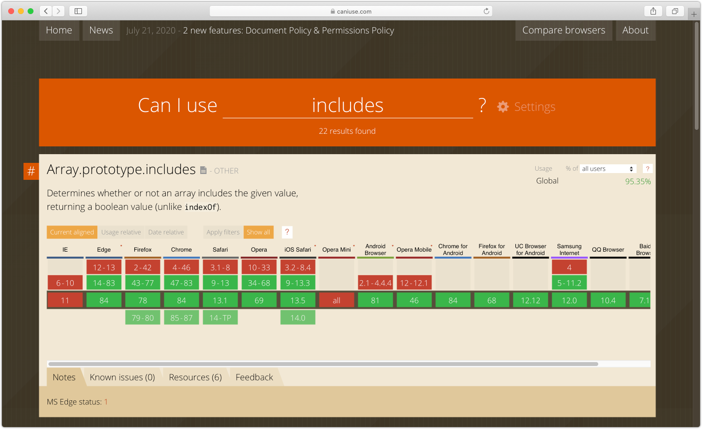

<!-- START doctoc generated TOC please keep comment here to allow auto update -->
<!-- DON'T EDIT THIS SECTION, INSTEAD RE-RUN doctoc TO UPDATE -->
## Table of Contents

- [Modern JavaScript](#modern-javascript)
  - [Objectives of this course](#objectives-of-this-course)
  - [Prerequisites](#prerequisites)
    - [Check your knowledge of JS](#check-your-knowledge-of-js)
  - [Introduction](#introduction)
  - [Quirks](#quirks)
    - [Make sure your target browser supports the feature!](#make-sure-your-target-browser-supports-the-feature)
    - [Undefined everywhere!](#undefined-everywhere)
    - [Printing and interacting with the console](#printing-and-interacting-with-the-console)
    - [Casting](#casting)
      - [Always use triple comparators (`===`) instead of double (`==`)](#always-use-triple-comparators--instead-of-double-)
    - [Primitive types vs. reference types](#primitive-types-vs-reference-types)
    - [`Object` and `Array` methods](#object-and-array-methods)
  - [Prototypes in JavaScript](#prototypes-in-javascript)
  - [Object literals, assignment and destructuring](#object-literals-assignment-and-destructuring)
    - [Objects](#objects)
    - [Array](#array)
  - [`let` and `const`](#let-and-const)
    - [Hoisting](#hoisting)
  - [Arrow functions](#arrow-functions)
    - [How `this` works in arrow functions](#how-this-works-in-arrow-functions)
    - [Best practices](#best-practices)
  - [Classes](#classes)
  - [Template literals](#template-literals)
    - [Template tags](#template-tags)
  - [Loops](#loops)
    - [`for... of`](#for-of)
  - [Promises](#promises)
    - [Creating a promise](#creating-a-promise)
    - [Consuming a promise](#consuming-a-promise)
    - [Chaining promises](#chaining-promises)
  - [Async functions](#async-functions)
  - [Modules](#modules)
    - [Imports](#imports)
    - [Exports](#exports)
  - [Other features](#other-features)
    - [Optional chaining](#optional-chaining)
  - [Self assessment](#self-assessment)
  - [References](#references)

<!-- END doctoc generated TOC please keep comment here to allow auto update -->

# Modern JavaScript

Note: run code quickly with https://codesandbox.io/s/

- JavaScript: https://codesandbox.io/s/front-end-training-014br

## Objectives of this course

- Review the syntax of modern JavaScript features
- Mention some JS best practices

## Prerequisites

This course assumes you already have experience with JavaScript. If you don't, start with this:

- [JavaScript First Steps](https://developer.mozilla.org/en-US/docs/Learn/JavaScript/First_steps), MDN
- [Learn JavaScript](https://learnjavascript.online/)

### Check your knowledge of JS

- What are the 5 JS datatypes?
  - `Number`, `String`, `Boolean`, `Object`, `Undefined`
- What does `1 / "a"` evaluate to?
  - `NaN`

## Introduction

JavaScript is a programming language evolving very rapidly that can run in different environments:

- Browser (the assumed target for this document).
- Computer and embedded systems (usually through node)
- Mobile and desktop apps with frameworks such as Electron, React Native, etc.

Key historical elements:

- September 1995: LiveScript is released in the Netscape Navigator Browser. It was developed by Brendan Eich.
- June 1997: Ecma International releases the first ECMAScript language _specification_. (note: the European Computer Manufacturers Association was founded in 1961 to standardize computer systems)
- December 2009: the ECMAScript 5 standard is released.

From 2016 to today, a new version of ECMAScript is released each year. The language has reached maturity and supports many modern constructs.

Key features of JavaScript:

- It is **imperative** & inspired by C
  - `if`, `while`, `switch`, `while`, `do while`
- It is **weakly typed**: it has types (`String`, `Number`, etc.) but uses implicit cast (`"1" - "1" === 0`).
- It is **dynamically typed**: types are associated with values rather than expressions (a variable `x` can be associated with a `String`, then with a `Number`).
- It supports **runtime evaluation** with `eval`. `eval('1 === 1')` evaluates to `true`
- It supports **object orientation** with a very powerful prototype-based approach.
- While it is not necessarily considered a pure functional language, its **functions are first-class citizen**. It supports closures and anonymous functions. As a result, it can be used to go pretty far with functional programming patterns.
- It is very **concise**. Newer features such as arrow functions, object and array destructuring leads to very terse code with a very high signal to noise ration.

## Quirks

### Make sure your target browser supports the feature!

Use [caniuse](https://caniuse.com/) to check what browser support the feature you're using. For instance, for `[1, 2].includes(1)` requires `Array.prototype.includes`:



You can then use "polyfills" (or "shims") to support older browser. There are some polyfills for each specific feature, and some other that includes lots of polyfills (e.g. [zloirock/core-js](https://github.com/zloirock/core-js#ecmascript-array)).

### Undefined everywhere!

```javascript
var a;
// an uninitialized variable is undefined
console.assert(typeof a === "undefined");

// There are no required arguments in JavaScript
function hello(name) {
  return name;
}

// No raise, will log "undefined"
console.log(hello());

// Here's how to compare to undefined
console.assert(typeof undefined === "undefined");

const anObject = { a: 1 };
// Accessing an absent object key also returns undefined
console.assert(typeof anObject.nonExistent === "undefined");
```

### Printing and interacting with the console

```javascript
// Do not leave console.log in your code!
// There are linters such as eslint that will check for their absence
console.log("hello");

// In this document, we use assert to show the actual value
console.assert(true === true);
```

### Casting

Rules for string conversion:

- `String` are left as is.
- `Number` are converted to their string representation.
- Elements of `Array` are converted to string, then joined with commas `,`.
- Objects are converted to `[object Object]` where `Object` is the constructor of the object.

Can you guess how those will be converted?

```javascript
[] + []

{} + {}

"1" + 1

"1" + "1"

"1" - 1

[1, 2] + 2

[1] + 1

function Dog {}

const dog = new Dog()

dog + 1 + "a"

dog - 1
```

#### Always use triple comparators (`===`) instead of double (`==`)

```javascript
// Double equals will coerce values to make them comparable!
console.assert("1" == 1);

// Better
console.assert(!("1" === 1));
console.assert("1" !== 1);
```

### Primitive types vs. reference types

Applied on arrays and objects, `==` and `===` will check for object identity, which is almost never what you want.

```javascript
console.assert({ a: 1 } != { a: 1 });
console.assert({ a: 1 } !== { a: 1 });

const obj = { a: 1 };
const obj2 = obj;
// This is true because obj and obj2 refer to the same object ("identity")
console.assert(obj == obj2);
console.assert(obj === obj2);
```

Use a library such as [lodash](https://lodash.com/) to properly compare objects and array

```javascript
import _ from "lodash";

console.assert(_.isEqual({ a: 1 }, { a: 1 }));
console.assert(_.isEqual([1, 2], [1, 2]));
```

### `Object` and `Array` methods

```javascript
// Use Object.assign (ES 2015) to copy objects
const target = { a: 1, b: 1};
const source = { b: 2};
const merged = Object.assign(target, source);
console.assert(_.isEqual(merged, {a: 1, b:2});

// Array.includes (ES7)
const theArray = [1, 2]
console.assert(theArray.includes(1))
```

## Prototypes in JavaScript

JavaScript has a very powerful prototypal inheritance system that is very interesting to study.

The truth is, it is much less used nowadays, and you don't really need to know it to develop with React. It also requires a bit of personal study to fully understand it. So we will leave it aside for now.

The book [JavaScript: The Good Parts](https://www.oreilly.com/library/view/javascript-the-good/9780596517748/) by Douglas Crockford (2008) is a great introduction to it. Here's a quote from the author:

> You make prototype objects, and then … make new instances. Objects are mutable in JavaScript, so we can augment the new instances, giving them new fields and methods. These can then act as prototypes for even newer objects. We don't need classes to make lots of similar objects… Objects inherit from objects. What could be more object oriented than that?

Some good articles:

- [A Plain English Guide to JavaScript Prototypes](http://sporto.github.io/blog/2013/02/22/a-plain-english-guide-to-javascript-prototypes/)

## Object literals, assignment and destructuring

### Objects

```javascript
const toaster = { size: 2, color: "red", brand: "NoName" };

// Get ("destructure") one object key
const { size } = toaster;
console.assert(size === 2);

// Note: this also works with functions
function destructuredFunction({ color }) {
  return color;
}

console.assert(destructuredFunction({ color: "red" }) === "red");

// Get the rest with ...rest
const { color, brand, ...rest } = toaster;
console.assert(_.isEqual(rest, { size: 2 }));

// Set default
const { size2 = 3 } = toaster;
console.assert(size2 === 3);

// Rename variables
const { size: size3 } = toaster;
console.assert(size3 === 2);
```

Enhanced object literals:

```javascript
const name = "Louis";
const person = { name };
console.assert(_.isEqual(person, { name: "Louis" }));

// Dynamic properties
const person2 = { ["first" + "Name"]: "Olympe" };
console.assert(_.isEqual(person2, { firstName: "Olympe" }));
// Btw, you can include quotes although nobody does this
console.assert(_.isEqual(person2, { firstName: "Olympe" }));

// Short form function

// Before:
const es5Object = {
  say: function () {
    console.log("hello");
  },
};
es5Object.say();

// After: (short form function)
const es6Object = {
  say() {
    console.log("hello");
  },
};
es6Object.say();
```

Advanced (with prototype):

```javascript
// Prototype and super()
const firstObject = {
  a: "a",
  hello() {
    return "hello";
  },
};

const secondObject = {
  __proto__: firstObject,
  hello() {
    return super.hello() + " from second object";
  },
};

console.assert(secondObject.hello() === "hello from second object");
```

### Array

```javascript
const theArray = [1, 2, 3];
const [first, second] = theArray;
const [first1, second2, ...rest] = theArray;

console.assert(first === 1);
console.assert(second === 2);
console.assert(_.isEqualWith(rest, [3]));
```

## `let` and `const`

```javascript
const constantVar = "a";

// Raises "constantVar" is read-only
constantVar = "b";

let theVar = "a";
theVar = "a";

// Note: const != immutable
const constantObject = { a: 1 };
constantObject.a = 2;
constantObject.b = 3;

// Raises: "constantObject" is read-only
constantObject = { a: 1 };

// const and let are block scoped. A block is enclosed in {} (if, loops, functions, etc.)
{
  const a = "a";
  console.log({ a });
}
// Raises: ReferenceError: a is not defined
console.log({ a });
```

Note: try to use `const` as much as you can.

- Those variables can't be reassigned. More constraints leads to safer code.
- You can't define a `const` without providing its initial value.
- Most people do this in modern JS.

Never use `var`:

- `var` variables are initialized with `undefined`, while `let` and `const` vars are not initialized and will raise an error if used before definition.
- `var` is globally or function-scoped, depending on whether it is used inside a function.
- `let` and `const` are block-scoped
- `let` and `const` cannot be reused for the same variable name

Future of JavaScript: [tc39/proposal-record-tuple: ECMAScript proposal for the Record and Tuple value types](https://github.com/tc39/proposal-record-tuple)

### Hoisting

See [Hoisting on MDN](https://developer.mozilla.org/en-US/docs/Glossary/Hoisting)

```javascript
console.log(typeof variable); // undefined
// console.log(variable); // Raises: ReferenceError: variable is not defined

function hoist() {
  a = 20;
  var b = 100;
}

hoist();

// 20, accessible as a global variable outside of hoist
console.log(a);

// Raises: ReferenceError: b is not defined
// console.log(b);
```

## Arrow functions

The first advantage of arrow function is that they're shorter to write:

```javascript
// You can define a function this way:
const myFunction = function () {
  console.log("hello world");
};

// With an arrow function, you save a few characters:
const myArrowFunction = () => {
  console.log("hello world");
};

// Some things, like params parentheses, and function code brackets, are optional
const myFunctionToBeShortened = function (a) {
  return a;
};

// Shorter arrow function
const myFunctionToBeShortenedArrowV1 = (a) => {
  return a;
};

// Shortest arrow function
// Remove single param parenthesis, remove function code bracket, remove return
const myFunctionToBeShortenedArrowV2 = (a) => a;
console.assert(myFunctionToBeShortenedArrowV2(1) === 1);
```

### How `this` works in arrow functions

TODO

### Best practices

I usually keep the parameters parenthesis. If you add a parameter and weren't including them, you'll have to add them back:

```javascript
const a1 = (arg) => {};
const a2 = (arg1, arg2) => {};

// vs.
const a3 = (arg) => {};
```

## Classes

```javascript
class Toaster {
  constructor(color) {
    this.color = color;
  }

  dring() {
    return "dring";
  }
}

// Don't forget new!
// Raises: TypeError: Cannot call a class as a function
// const toaster = Toaster('red');

const toaster = new Toaster("red");
console.log(toaster.dring());

// Inheritance

class BunToaster extends Toaster {
  dring() {
    return super.dring() + " dring";
  }
}

const bunToaster = new BunToaster("red");
console.assert(bunToaster.dring() === "dring dring");
```

Those are my opinions about other class features:

- Avoid using `static` methods, use plain functions instead.
- Avoid using more than one level of inheritance.
- Avoid using getter and setters (`get` and `set`).
- Avoid using classes if you can.

## Template literals

```javascript
const longString = `multi
line
string`;

const name = "Louis";
// Template interpolation
const hello = `Hello ${name}`;

// You can have expressions
const hello1 = `Hello ${name + "!"}`;
const hello2 = `Hello ${name === "Louis" ? name : "Noname"}`;
```

### Template tags

They are used in some libraries, like Apollo and Styled Components.

```javascript
// First arg is an array of string values, the rest is the expressions

// ["hello ", ""], 3
function templateTag(literals, ...expressions) {
  console.assert(_.isEqual(literals, ["hello ", ""]));
  console.assert(_.isEqual(expressions, [3]));
  return _.join(_.flatten(_.zip(literals, expressions)), "");
}

const result = templateTag`hello ${1 + 2}`;
console.assert(result === "hello 3");
```

## Loops

### `for... of`

Note: prefer using some functional constructs such as `map`, `reduce`, etc.

```javascript
for (const i of [1, 2, 3]) {
  console.log({ i });
}
// 1, 2, 3

for (const key in { a: "aaa", b: "bbb" }) {
  console.log({ key });
}
// 'a', 'b'
```

## Promises

This is only going to be an introduction to the magnificent world of promise.

- Async functions (seen later) use promises as a building block.
- Promise are indeed async in nature: the calling code continues executing the promise does its thing.
- Some Web API return promises, including `Fetch`

### Creating a promise

Note: we use TypeScript in this example, to clarify what's return. You can ignore the type annotations for now.

```typescript
let isDone: boolean = true

const thePromise = new Promise((resolve, reject) => {
  if (isDone) {
    resolve("the work is done");
  } else {
    reject("this is still pending");
    }
    }

console.assert(thePromise === 'the work is done')
```

TODO

### Consuming a promise

### Chaining promises

## Async functions

## Modules

CommonJS syntax:

```javascript
const lodash = require("lodash");
```

ES Module syntax:

```javascript
import lodash from "lodash";
```

### Imports

```javascript
// Import all and provide under name
import * as toaster from "./toaster";

// Named import (same as object destructuring!)
import { defaultColor, defaultSize } from "./toaster";

// Renaming imports
import { defaultBrand as toasterDefaultBrand } from "./toaster";

// Default import
import createToaster from "./toaster";

// Import both defaults and other
// import createToaster, {defaultColor} from './toaster'
```

### Exports

In `toaster.js`:

```javascript
// Shorthand definition + export
export const defaultSize = 4;

// Alternative export syntax
const defaultBrand = "Moulinex";
export { defaultBrand };

// Default export
const createToaster = ({ size, color }) => ({ size, color });
export default createToaster;

// Note that you have a shorthand default export, but it's not recommended to
// use it as the export won't have a name.
// export default () => ({})
```

## Other features

### Optional chaining

```javascript
let nestedProp = obj.first && obj.first.second;

// with optional chaining:
let nestedProp = obj.first?.second;
```

## Self assessment

- How old is JavaScript?
- Is it a modern language?
- Can we say that JavaScript does not have types?
- What is the value of this expression: `"1" + "1"`? `3 + 2 + "5"`?
- What should I use? `let`, `var`, or `cost`?
- How do you add support for modern JS features in older browsers?
- How are variables scoped in JavaScript?
- What should you watch for when comparing variables in JavaScript?
- `const a = [1]; const b = [1];`: what does `b == b` evaluates to?
- How do you write arrow functions?
- `const {a} = {a: 1}`: what does `a` evaluate to?

Advanced:

- How does JavaScript "inherit" from each other?
- If `const toaster = {name: 'Foo'}` and I want `const obj = {Foo: 1}`. How can I write this whatever the `toaster`'s `name`?

Other assessments:

- [37 Essential JavaScript Interview Questions and Answers](https://www.toptal.com/javascript/interview-questions)
- [70 JavaScript Interview Questions](https://dev.to/macmacky/70-javascript-interview-questions-5gfi), DEV

## References

- [ES5 to ESNext — here’s every feature added to JavaScript since 2015](https://www.freecodecamp.org/news/es5-to-esnext-heres-every-feature-added-to-javascript-since-2015-d0c255e13c6e/)
- [ES2015 / ES6: Basics of modern Javascript](https://www.slideshare.net/WojciechDzikowski/es2015-es6-basics-of-modern-javascript)
- [JavaScript](https://en.wikipedia.org/wiki/JavaScript), Wikipedia
- [mbeaudru/modern-js-cheatsheet](https://github.com/mbeaudru/modern-js-cheatsheet)

Future changes:

- [tc39/proposal-record-tuple: ECMAScript proposal for the Record and Tuple value types.](https://github.com/tc39/proposal-record-tuple)
